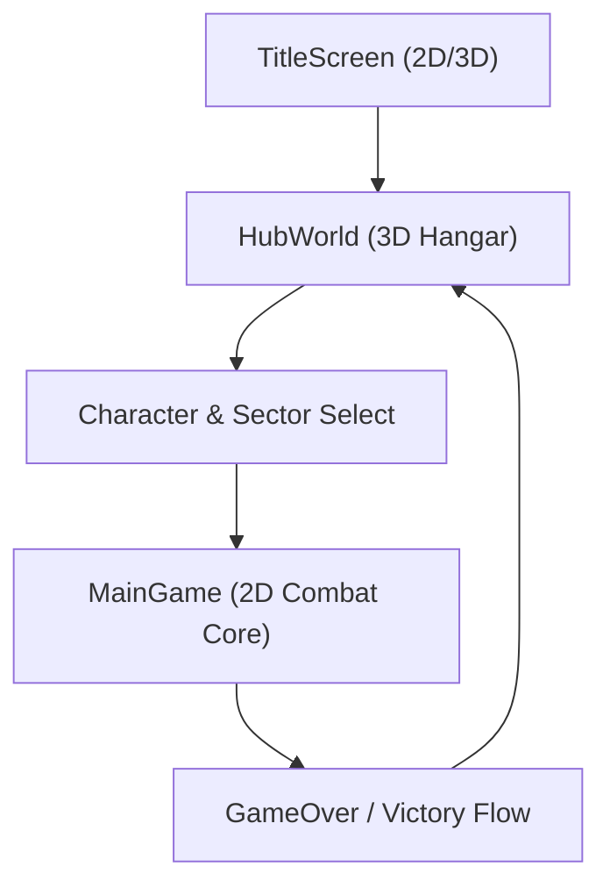
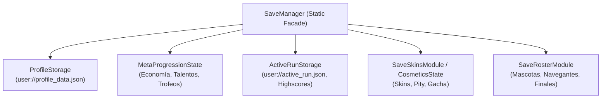

# Arquitectura del Proyecto — Astra Dream

> Documento maestro de arquitectura técnica y contratos del sistema.
> Orientado a desarrolladores y agentes de IA para operar con **Zero Context**.
> 
> 📄 **Árbol maestro y mapa de archivos completo:** Consulta [Guía y Árbol Maestro Zero-Context](file:///c:/Users/Frani/.gemini/antigravity/scratch/astra_dream/docs/architecture/zero_context_architecture_and_file_tree.md).

---

## 1. Visión General y Dualidad 3D / 2D

Astra Dream está estructurado sobre una clara separación entre dos mundos principales:



1. **Hangar Espacial 3D (`scenes/ui/hub/`):**
   - Espacio 3D en tercera persona con movimiento en tiempo real del piloto.
   - Geometría modular procedural construida por [`HubHangarBuilder3D`](file:///c:/Users/Frani/.gemini/antigravity/scratch/astra_dream/scenes/ui/hub/components/hub_hangar_builder_3d.gd).
   - Terminales interactivos gestionados por [`HubTerminalManager`](file:///c:/Users/Frani/.gemini/antigravity/scratch/astra_dream/scenes/ui/hub/components/hub_terminal_manager.gd).
   - Despacho de modales mediante `HubInteractionsCoordinator` y pasarela de iluminación con `HubPilotShowcaseController`.

2. **Núcleo de Combate 2D (`scenes/combat/`):**
   - Escena principal [`MainGame`](file:///c:/Users/Frani/.gemini/antigravity/scratch/astra_dream/scenes/combat/main_game.gd) actuando como director orquestador modular.
   - Coordinación de modales desacoplada mediante [`CombatModalCoordinator`](file:///c:/Users/Frani/.gemini/antigravity/scratch/astra_dream/scenes/combat/ui/combat_modal_coordinator.gd).
   - Narrativa y cinemáticas de radio mediante [`CombatNarrativeDirector`](file:///c:/Users/Frani/.gemini/antigravity/scratch/astra_dream/scenes/combat/directors/combat_narrative_director.gd) y [`CombatRadioFeedController`](file:///c:/Users/Frani/.gemini/antigravity/scratch/astra_dream/scenes/combat/directors/combat_radio_feed_controller.gd).
   - Encuentros con colosos y saltos de oleada mediante [`CombatBossCoordinator`](file:///c:/Users/Frani/.gemini/antigravity/scratch/astra_dream/scenes/combat/directors/combat_boss_coordinator.gd), [`BossCinematicPresenter`](file:///c:/Users/Frani/.gemini/antigravity/scratch/astra_dream/scenes/combat/bosses/boss_cinematic_presenter.gd) y [`CombatBossDebugJumper`](file:///c:/Users/Frani/.gemini/antigravity/scratch/astra_dream/scenes/combat/directors/combat_boss_debug_jumper.gd).
   - Ciclo de vida y tiendas de satélites mediante [`CombatSatelliteCoordinator`](file:///c:/Users/Frani/.gemini/antigravity/scratch/astra_dream/scenes/combat/systems/combat_satellite_coordinator.gd).
   - Spawning masivo y reciclaje Zero-Allocation con [`EnemySpawner`](file:///c:/Users/Frani/.gemini/antigravity/scratch/astra_dream/scenes/combat/enemies/enemy_spawner.gd) y [`EnemyNodePool`](file:///c:/Users/Frani/.gemini/antigravity/scratch/astra_dream/scenes/combat/enemies/enemy_node_pool.gd).
   - Servidor masivo de balas Zero-Allocation: [`BulletServer`](file:///c:/Users/Frani/.gemini/antigravity/scratch/astra_dream/core/autoloads/bullet_server.gd).

---

## 2. Autoloads y Servicios de Infraestructura

Los únicos Autoloads globales permitidos residen en `core/autoloads/`:

| Autoload | Archivo | Responsabilidad Única |
| :--- | :--- | :--- |
| `SaveManager` | [`save_manager.gd`](file:///c:/Users/Frani/.gemini/antigravity/scratch/astra_dream/core/autoloads/save_manager.gd) | Fachada estática ligera delegando a submódulos de persistencia física en disco. |
| `BulletServer` | [`bullet_server.gd`](file:///c:/Users/Frani/.gemini/antigravity/scratch/astra_dream/core/autoloads/bullet_server.gd) | Renderizado multimesh y física O(N) para hasta 10,000 proyectiles sin alocar nodos. |
| `AudioManager` | [`audio_manager.gd`](file:///c:/Users/Frani/.gemini/antigravity/scratch/astra_dream/core/autoloads/audio_manager.gd) | Canales dinámicos (BGM, SFX, Radio), fatiga acústica y pitch variance. |
| `SettingsManager` | [`settings_manager.gd`](file:///c:/Users/Frani/.gemini/antigravity/scratch/astra_dream/core/autoloads/settings_manager.gd) | Ajustes gráficos, volumen, zona muerta de mando y atajos de teclado. |

---

## 3. Arquitectura de Persistencia Modular

La persistencia del juego no es un bloque monolítico; se organiza en módulos especializados dentro de `core/systems/persistence/`:



- **`ProfileStorage`:** Serialización segura, esquema versión 2, migración y valores por defecto.
- **`MetaProgressionState`:** Monedas (`biomass`, `antimatter`, `dark_matter`), árboles de habilidades de las 8 heroínas y pasivas permanentes de trofeos.
- **`ActiveRunStorage`:** Guardado y reanudación mid-run, ordenamiento multicriterio (Oleada > Tiempo > Kills) y permadeath.
- **`CosmeticsState` / `SaveSkinsModule`:** Gacha tokens, estrellas (1★, 2★, 3★ con shaders) y pity counters.

---

## 4. Servidor de Balas: Zero-Allocation Danmaku

Queda estrictamente prohibido instanciar nodos `Area2D` individuales para proyectiles enemigos masivos o disparos de alta cadencia.

### Principio de Diseño
- `BulletServer` administra un búfer contiguo de memoria (`PackedFloat32Array`).
- Cada bala se almacena en 16 floats consecutivos (x, y, vx, vy, radio, daño, tipo, vida, etc.).
- La renderización se realiza en 1 solo draw call por cada tipo de proyectil utilizando `MultiMeshInstance2D`.
- Las colisiones se verifican espacialmente mediante barrido circular directo contra el círculo de colisión del jugador.

### Invocación de Disparo Danmaku
```gdscript
BulletServer.spawn_bullet(
    pos: Vector2,
    dir: Vector2,
    speed: float,
    damage: float,
    bullet_type: int
)
```

---

## 5. Contratos de Combate Obligatorios

Toda entidad que inflija o reciba daño en Astra Dream debe respetar rigurosamente los siguientes contratos:

### Contrato `HitContext`
Estructura fuertemente tipada para transportar datos de impacto:
```gdscript
class_name HitContext
extends RefCounted

var damage: float = 0.0
var source: Node2D = null
var is_critical: bool = false
var proc_coefficient: float = 1.0 # Modulador de efectos al impactar (0.0 a 1.0)
var element_type: StringName = &"kinetic"
var knockback_vector: Vector2 = Vector2.ZERO
```

### Contrato `take_damage`
Cualquier entidad vulnerable (jugador, enemigos estándar, élites y colosos) DEBE exponer:
```gdscript
func take_damage(ctx: HitContext) -> void:
    # 1. Aplicar mitigación o escudo
    # 2. Reducir HP
    # 3. Disparar efectos de sonido y partículas
    # 4. Verificar condición de muerte
```

---

## 6. Convenciones de Datos (Data-Driven Estricto)

El 100% del balance numérico reside en archivos `.tres` derivados de las siguientes clases base:
- `CharacterData`: Vida base, velocidad, cadencia, sprite, dash y keystone inicial.
- `WeaponData`: Daño base, cooldown, número de proyectiles, dispersión, escala por nivel.
- `ItemData`: Estadísticas pasivas, rareza, modificadores acumulativos.
- `SectorData`: Dificultad, multiplicadores de loot, paleta de fondo, rival asignado.
- `EncounterTimelineConfig`: Pautas de tiempo de oleadas y aparición de colosos.

---

## 7. Sistema de Depuración Desacoplado (Producción Zero-Cost)

El testing del juego se divide limpiamente en dos capas:
1. **Depuración Pre-Game (`scenes/ui/debug/debug_menu_modal.gd`):** Integrado en el Hangar/Selección de Personaje. Gestiona economía meta, tokens de gacha, biomasa/stardust, desbloqueo y estrellas de skins (1★/3★), compañeros (Cosmo/Iris) y reseteo de progreso.
2. **Depuración In-Game (`scenes/ui/debug/ingame_debug_modal.gd`):** Activado con **`F1`** en combate (`layer 125`, pausa activa). Cuatro pestañas modulares:
   - *Spawns & Entidades:* Monolito Arcano frente al jugador a ~200px, Colosos y Rivales (con toggle de intro), balizas y limpieza masiva.
   - *Cheats & Stats:* God Mode, créditos infinitos, bombas fijas, velocidad y 15 sliders de atributos en tiempo real.
   - *Arsenal & Items:* Inyección de armas respetando el bloqueo permanente de la ranura 0, upgrades de nivel y selector de arcanas.
   - *Oleadas & Crisis:* Salto de oleada, disparo de Tormenta Solar y control temporal.
3. **Poda en Producción:** `DebugManager.is_debug_enabled()` destruye los botones interactivos con `queue_free()` e inhabilita atajos en builds de exportación sin reservar memoria ni generar sobrecoste.
