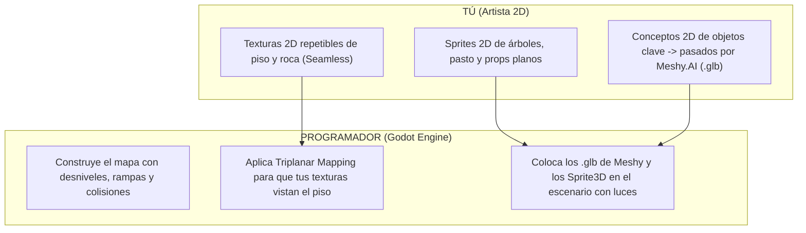

# Guía de Evaluación: Meshy.AI para el Artista de Astra Dream

> **Para:** Artista 2D del equipo  
> **Tema:** Uso de Meshy.AI para crear assets 3D a partir de tus dibujos 2D  
> **Motor del Proyecto:** Godot 4.7 (Perfil Mobile / Rendimiento a 60 FPS)

---

## 1. En una frase: ¿Nos sirve?

**SÍ, pero como una "fábrica de objetos 3D individuales", no para hacer el mapa entero.**

Meshy.AI te permite convertir tus dibujos 2D en modelos 3D volumétricos reales con texturas en menos de 2 minutos, sin que tengas que aprender Blender, ni polígonos, ni mapeo UV.

---

## 2. Lo que SÍ nos sirve (Tus superpoderes con Meshy)

### A. "Image to 3D" para Props Complejos
Si necesitas que el Hub tenga una pared de piedra con tallados, un pilar roto, un monolito alienígena, un altar o una computadora retro en 3D real:
1. Dibujas el objeto en 2D en tu programa habitual (Photoshop, Krita, Procreate, Aseprite).
2. Lo subes a Meshy.AI en la opción **"Image to 3D"**.
3. Meshy genera la malla 3D completa basada en tu dibujo.
4. Lo descargas en formato **`.glb`** y se lo pasas al programador (entra directo a Godot).

### B. Modo "Low Poly / Smart Topology"
En videojuegos no podemos meter modelos con millones de triángulos porque el juego se pondría lento. Meshy tiene una casilla llamada **"Low Poly"** o **"Smart Topology"** donde le puedes decir que la malla tenga pocos polígonos (ej. 1.000 a 3.000 triángulos). Esto es perfecto para que el juego corra súper fluido.

### C. Generación de Texturas PBR y Relieves
Meshy puede generar automáticamente los mapas de **Normales (relieve)** y **Roughness (brillo/rugosidad)** para que el sol y las luces 3D del motor iluminen tu objeto con sombras y volumen creíbles.

### D. Formato Nativo de Godot (.GLB)
Meshy exporta en formato `.glb`. En Godot, un `.glb` se arrastra a la carpeta del proyecto y el motor lo reconoce al instante con todas sus texturas, materiales y geometrías listas.

---

## 3. Lo que NO nos sirve (Lo que NO debes intentar hacer con Meshy)

Para no perder tiempo ni frustrarnos con la herramienta, hay cosas que **la IA no hace bien y que es mejor resolver directamente en el motor**:

### ❌ 1. No intentes generar el mapa / terreno completo
* **Por qué no sirve:** No le puedes pedir a Meshy "un nivel completo con colinas, caminos, rampas y escaleras". La IA generará una masa deforme sin escala real donde el personaje se trabará o flotará.
* **Cómo lo solucionamos:** La arquitectura del mapa (el suelo con desniveles, las rampas donde camina el jugador y los muros límite) la arma el programador en 5 minutos dentro de Godot con bloques sólidos paramétricos (CSG). Así garantizamos colisiones perfectas y que el personaje se mueva sin bugs.

### ❌ 2. No reemplaza a los Sprites 2D para árboles, pasto y personajes
* **Por qué no sirve:** Los árboles y plantas generados por IA en 3D suelen tener una cantidad excesiva de polígonos feos o ramas pesadas que arruinan la tasa de fotogramas en móviles.
* **Cómo lo solucionamos:** Los árboles, flores, pasto y pilotos se mantienen como tus ilustraciones **2D transparentes clásicas** (`Sprite3D` con rotación Billboard). Se ven infinitamente más hermosos, conservan tu trazo artístico artesanal y no consumen rendimiento.

### ❌ 3. Ojo con el estilo de textura (Evitar el realismo genérico)
* **Por qué tener cuidado:** Si no se especifica, la IA tiende a poner texturas hiperrealistas o "sucias" que desentonan con la estética estilizada y anime/ciberpunk de Astra Dream.
* **Cómo solucionarlo:** En el prompt de estilo de Meshy, siempre debes seleccionar o escribir etiquetas como: `stylized`, `hand-painted`, `clean anime texture`, `cel-shaded`.

---

## 4. El Reparto de Tareas (Cómo trabajamos juntos)

---

## 5. Prueba Rápida Recomendada (Tu primer test)

Para que experimentes sin costo (Meshy tiene créditos gratuitos al registrarse):

1. Entra en [Meshy.ai](https://www.meshy.ai/).
2. Elige un dibujo tuyo de un objeto sólido (por ejemplo: un monolito de piedra, una caja de suministros espacial, una columna en ruinas o una farola).
3. Selecciona **"Image to 3D"**.
4. En los ajustes de generación, activa **Low Poly** / **Stylized**.
5. Cuando termine, exporta como **GLB**.
6. Pásale ese archivo `.glb` al programador: lo meterá en el Hub en 10 segundos para que veas tu propio dibujo convertido en una pieza 3D iluminada dentro del juego.

---

## 6. Conclusión

Meshy.AI es una **gran aliada para acelerar tu trabajo**:
- **Tú sigues dibujando en 2D.**
- **Meshy hace el trabajo pesado de extruir el volumen 3D de los objetos difíciles.**
- **Godot une tu arte 2D y los objetos de Meshy en un diorama 2.5D fluido y estilizado.**
