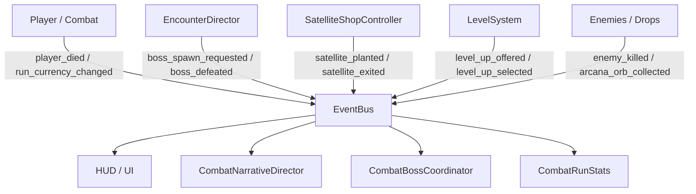

# Mapa de Autoloads y Bus de Señales — Astra Dream

Este documento proporciona una referencia exhaustiva y de contexto cero (Zero-Context) sobre la arquitectura de servicios globales (`Autoloads`), ciclo de vida, señales desacopladas y dependencias del proyecto.

---

## 1. Visión General de Autoloads

En Astra Dream, los Autoloads se restringen exclusivamente a **servicios de infraestructura puros** y orquestación global sin estado acoplado a entidades de combate. Toda lógica de juego local reside en controladores y componentes instanciados.

Definidos en [`project.godot`](file:///c:/Users/Frani/.gemini/antigravity/scratch/astra_dream/project.godot):

| Nombre Autoload | Script / UID | Modo de Proceso | Responsabilidad Principal |
| :--- | :--- | :--- | :--- |
| **`SettingsManager`** | [`res://core/autoloads/settings_manager.gd`](file:///c:/Users/Frani/.gemini/antigravity/scratch/astra_dream/core/autoloads/settings_manager.gd) | `PROCESS_MODE_ALWAYS` | Configuración de audio, gráficos/pantalla, deadzones e input mappings persistentes en `.cfg`. |
| **`SaveManager`** | [`res://core/autoloads/save_manager.gd`](file:///c:/Users/Frani/.gemini/antigravity/scratch/astra_dream/core/autoloads/save_manager.gd) | Inherit | Fachada centralizada para perfil meta, run activa, cosméticos, talentos y récords. |
| **`DebugManager`** | [`res://core/autoloads/debug_manager.gd`](file:///c:/Users/Frani/.gemini/antigravity/scratch/astra_dream/core/autoloads/debug_manager.gd) | Inherit | Flags de testing, God Mode, economía infinita y overrides numéricos de estadísticas. |
| **`EventBus`** | [`res://core/autoloads/event_bus.gd`](file:///c:/Users/Frani/.gemini/antigravity/scratch/astra_dream/core/autoloads/event_bus.gd) | Inherit | Bus pub-sub global de eventos de alto nivel de combate, oleadas y progreso. |
| **`AudioManager`** | [`res://core/autoloads/audio_manager.gd`](file:///c:/Users/Frani/.gemini/antigravity/scratch/astra_dream/core/autoloads/audio_manager.gd) | Inherit | Voice pooling (24 voces), modulación anti-fatiga, arpegios pentatónicos y reproducción BGM. |
| **`Dialogic`** | `uid://ds2q0uclmolvu` | Always | Motor narrativo para diálogos de personajes (`.dch`) y timelines de bosses/alertas (`.dtl`). |

> [!NOTE]
> **Servicio de Balas (`BulletServer`):** Reside en [`res://core/autoloads/bullet_server.gd`](file:///c:/Users/Frani/.gemini/antigravity/scratch/astra_dream/core/autoloads/bullet_server.gd) como `class_name BulletServer extends MultiMeshInstance2D`. No está instanciado como autoload global para evitar consumo de memoria en menús; se instancia en la escena de combate [`MainGame`](file:///c:/Users/Frani/.gemini/antigravity/scratch/astra_dream/scenes/combat/main_game.gd) y se registra en el grupo `"bullet_server"`.

---

## 2. Especificación Detallada de Autoloads

### 2.1 SettingsManager
- **Archivo de persistencia:** `user://settings.cfg` (`ConfigFile` nativo).
- **Señales:**
  - `settings_changed()`: Emitida tras cualquier alteración de volumen, resolución, pantalla completa o remapeo de teclas.
- **Secciones de Configuración:**
  - `[audio]`: `master` (0.0 - 1.0), `music` (0.0 - 1.0), `sfx` (0.0 - 1.0). Aplica conversión `linear_to_db` sobre los buses `AudioServer`.
  - `[display]`: `width`, `height`, `fullscreen` (`bool`). Controla `DisplayServer.window_set_mode` y centrado de ventana.
  - `[controller]`: `deadzone` (`float`, por defecto 0.15).
  - `[input]`: Mapeos personalizados de `InputMap` serializados con preservación de eventos de gamepad.

### 2.2 SaveManager (Fachada Arquitectónica)
`SaveManager` actúa como punto de contacto unificado delegando la lógica a submódulos desacoplados en `core/systems/persistence/` y `core/autoloads/save_modules/`:
- **`ProfileStorage`:** Maneja I/O a `user://profile_data.json`, validación de esquema y valores predeterminados.
- **`MetaProgressionState`:** Administra divisas meta (`Biomass`, `Antimatter`, `Dark Matter`), árboles de talentos y trofeos.
- **`SaveSkinsModule`:** Administra tokens de gacha, desbloqueo de skins y progresión de estrellas (1★, 2★, 3★).
- **`SaveRosterModule`:** Administra selección y desbloqueo de mascotas (Pets), navegantes (Navigators) y finales desbloqueados.
- **`ActiveRunStorage`:** Maneja guardado temporal de partidas en curso (`user://active_run.json`) y ranking top 10 (`user://highscores.json`).

### 2.3 DebugManager
- **Salvaguarda de Producción Zero-Friction:**
  - `FORCE_DISABLE_DEBUG` (`bool`): Bandera manual maestra (por defecto `false`).
  - `is_debug_enabled() -> bool`: Retorna `OS.is_debug_build() and not FORCE_DISABLE_DEBUG`.
  - En builds de exportación/producción, los botones de depuración se destruyen (`queue_free()`) y el atajo in-game `F1` queda completamente desactivado sin reservar memoria ni precargar interfaces.
- **División de Menús de Depuración:**
  - **Pregame (`scenes/ui/debug/debug_menu_modal.gd`):** Restringido estrictamente al metajuego en la pantalla de selección (Gacha, Tokens, Biomasa, Desbloqueo de Skins, Compañeros Cosmo/Iris y Reseteo de Carrera/Save).
  - **In-Game (`scenes/ui/debug/ingame_debug_modal.gd`):** Accesible con **`F1`** en pleno combate; pausa el árbol de juego (`PROCESS_MODE_ALWAYS`) y ofrece 4 pestañas: Spawns/Entidades (Monolitos directos frente al jugador a ~200px, Jefes con toggle de cinemática, Rivales, Tragaperras, Limpieza), Cheats/Stats (God Mode, Créditos 999k, Bombas 5, Sliders de estadísticas en vivo), Arsenal/Items (Inyección de armas, upgrades de nivel, selector de pactos) y Oleadas/Crisis (Salto de oleada, disparo de Tormenta Solar y eventos de crisis).
- **Flags principales:** `infinite_hp`, `infinite_credits`, `infinite_consumables`, `pending_debug_route`.
- **Diccionario de Estadísticas (`stat_overrides`):**
  - Permite sustituir en caliente cualquier estadística de [`CharacterStats`](file:///c:/Users/Frani/.gemini/antigravity/scratch/astra_dream/core/types/character_stats.gd) (`max_health`, `move_speed`, `base_damage`, `crit_chance`, `exp_multiplier`, etc.).
  - Configuración declarativa en `STAT_CONFIGS` con mínimos, máximos y formatos de visualización para las interfaces de depuración.

### 2.4 AudioManager
- **Pool de Voces:** Pre-instancia 24 nodos `AudioStreamPlayer` para evitar instanciación (`allocation`) en tiempo de ejecución.
- **Perfiles de Modulación Anti-Fatiga (`SFX_PROFILES`):**
  - `min_interval_ms`: Límite de tiempo mínimo entre dos reproducciones del mismo SFX para prevenir phasing acústico.
  - `max_polyphony`: Límite máximo de instancias sonando en paralelo para un mismo efecto.
  - `pitch_min` / `pitch_max`: Jitter de afinación aleatoria para que cada impacto o disparo suene orgánico.
  - `vol_jitter_db`: Jitter de ganancia dinámica.
- **Arpegiador Pentatónico de EXP:**
  - Al recoger orbes de experiencia de manera consecutiva (`EXP_COMBO_TIMEOUT_MSEC = 420`), incrementa el pitch según la escala musical `[0.88, 0.94, 1.00, 1.06, 1.12, 1.18, 1.25, 1.32, 1.40, 1.48, 1.56, 1.65]` produciendo satisfacción sonora tipo arcade sin saturación estridencial.

### 2.5 Dialogic
- **Integración:** Sistema Dialogic 2 para Godot 4.
- **Personajes Registrados (`.dch`):**
  - Pilotos: `nova`, `valentina`, `kira`, `selene`, `roxy`, `echo`.
  - Navegantes: `lyra`, `vespera`, `caelia`, `zephyr`.
  - Mascotas: `mochi`, `kuro`, `luna`, `pip`.
  - Antagonistas: `sombra_nyx`, `nyx`, `iris`, `cosmo`.
- **Timelines Clave (`.dtl`):**
  - Alertas de jefes: `boss_titan_alert`, `pet_boss_alert`.
  - Eventos de historia: `prologue_cinematic`, `ending_normal`, `ending_true`.

---

## 3. Diccionario del Bus de Eventos (`EventBus`)

[`EventBus`](file:///c:/Users/Frani/.gemini/antigravity/scratch/astra_dream/core/autoloads/event_bus.gd) desacopla emisores de receptores mediante el patrón Publicador-Suscriptor, garantizando que el combate, el HUD y los directores no dependan de referencias cruzadas directas.

### Catálogo de Señales

#### 1. `level_up_offered(level: int)`
- **Emisor:** Sistema de nivel del jugador / experiencia.
- **Receptor:** [`HUD`](file:///c:/Users/Frani/.gemini/antigravity/scratch/astra_dream/scenes/ui/hud/hud.gd), Gestor de selección de cartas / mejoras.
- **Propósito:** Notificar que el jugador acumuló suficiente experiencia para subir de nivel y pausar/desplegar la interfaz de recompensa.

#### 2. `level_up_selected(stat_card: StatCardData)`
- **Emisor:** Modal de selección de nivel / cartas de atributos.
- **Receptor:** Controlador de inventario y estadísticas del jugador.
- **Propósito:** Aplicar las estadísticas del recurso seleccionado al jugador y reanudar el flujo del juego.

#### 3. `satellite_planted(satellite_index: int, position: Vector2)`
- **Emisor:** [`SatelliteStation`](file:///c:/Users/Frani/.gemini/antigravity/scratch/astra_dream/scenes/combat/satellite/satellite_station.gd).
- **Receptor:** [`EncounterDirector`](file:///c:/Users/Frani/.gemini/antigravity/scratch/astra_dream/scenes/combat/directors/encounter_director.gd), [`HUD`](file:///c:/Users/Frani/.gemini/antigravity/scratch/astra_dream/scenes/ui/hud/hud.gd).
- **Propósito:** Informar el despliegue del satélite de suministros/tienda, alterando la presión de oleadas enemigas y habilitando la baliza de extracción o recarga.

#### 4. `satellite_exited(satellite_index: int)`
- **Emisor:** [`SatelliteShop`](file:///c:/Users/Frani/.gemini/antigravity/scratch/astra_dream/scenes/combat/satellite/satellite_shop.gd).
- **Receptor:** Director de encuentros, reanudando la cadencia de oleadas de combate.

#### 5. `run_currency_changed(new_amount: int)`
- **Emisor:** Jugador al recolectar créditos o gastarlos en la tienda satelital.
- **Receptor:** [`HUD`](file:///c:/Users/Frani/.gemini/antigravity/scratch/astra_dream/scenes/ui/hud/hud.gd) (actualización de display numérico).

#### 6. `boss_spawn_requested(timeline_id: String, boss_id: String, is_secret: bool)`
- **Emisor:** [`EncounterDirector`](file:///c:/Users/Frani/.gemini/antigravity/scratch/astra_dream/scenes/combat/directors/encounter_director.gd).
- **Receptor:** [`CombatBossCoordinator`](file:///c:/Users/Frani/.gemini/antigravity/scratch/astra_dream/scenes/combat/directors/combat_boss_coordinator.gd), [`CombatNarrativeDirector`](file:///c:/Users/Frani/.gemini/antigravity/scratch/astra_dream/scenes/combat/directors/combat_narrative_director.gd).
- **Propósito:** Iniciar alerta cinemática de jefe (Dialogic alert, barras de vida dedicadas, música temática).

#### 7. `boss_defeated(boss_id: String)`
- **Emisor:** Entidad del Boss al agotar su vida y reproducir su efecto de explosión.
- **Receptor:** [`CombatBossCoordinator`](file:///c:/Users/Frani/.gemini/antigravity/scratch/astra_dream/scenes/combat/directors/combat_boss_coordinator.gd), [`SaveManager`](file:///c:/Users/Frani/.gemini/antigravity/scratch/astra_dream/core/autoloads/save_manager.gd), estadísticas de carrera.
- **Propósito:** Registrar muerte de jefe, desbloquear trofeos asociados y habilitar portales o transiciones de fase.

#### 8. `player_died()`
- **Emisor:** [`Player`](file:///c:/Users/Frani/.gemini/antigravity/scratch/astra_dream/scenes/combat/player/player.gd) al agotar su barra de salud.
- **Receptor:** [`MainGame`](file:///c:/Users/Frani/.gemini/antigravity/scratch/astra_dream/scenes/combat/main_game.gd), [`GameOverModal`](file:///c:/Users/Frani/.gemini/antigravity/scratch/astra_dream/scenes/ui/game_over/game_over_modal.gd), audio ambiental de derrota.
- **Propósito:** Detener spawn de enemigos, calcular recompensas de la partida y presentar pantalla de Game Over.

#### 9. `enemy_killed(enemy_type: String)`
- **Emisor:** [`HurtboxComponent`](file:///c:/Users/Frani/.gemini/antigravity/scratch/astra_dream/core/components/hurtbox_component.gd) / scripts de enemigos comunes y élites.
- **Receptor:** Registro de estadísticas de partida (`CombatRunStats`), desbloqueo de logros y misiones.

#### 10. `arcana_orb_collected(orb: Node2D)`
- **Emisor:** Orbes arcanos especiales generados en campo de batalla.
- **Receptor:** [`MainGame`](file:///c:/Users/Frani/.gemini/antigravity/scratch/astra_dream/scenes/combat/main_game.gd) / Modal de cartas arcanas (`ArcanaSelectionModal`).
- **Propósito:** Abrir la interfaz de cartas de tarot/arcana para seleccionar mutadores pasivos únicos de la partida.
