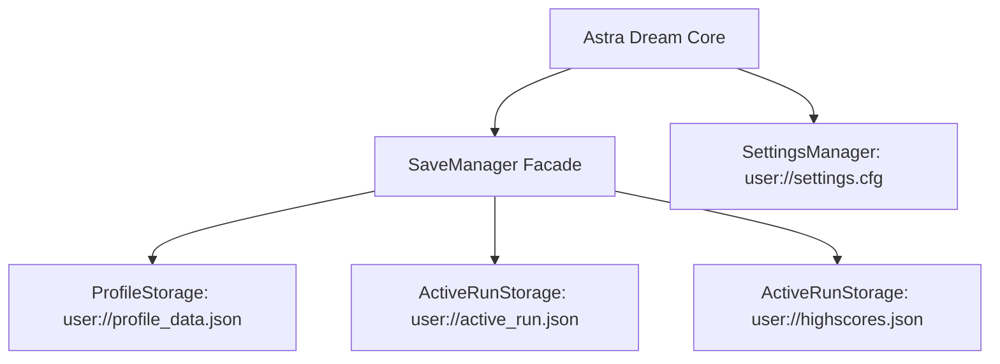
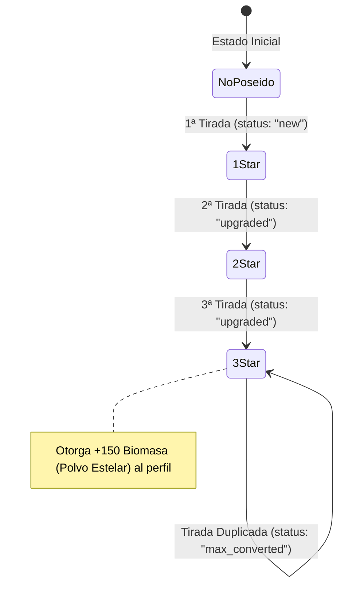

# Esquema de Persistencia y Datos Guardados — Astra Dream

Este documento define la especificación técnica completa del sistema de persistencia en disco de Astra Dream, detallando el esquema de datos de usuario, control de versiones, migración hacia adelante, reglas de cosméticos y fórmulas económicas.

---

## 1. Topología de Almacenamiento en Disco

El juego almacena sus estados en la ruta aislada del motor `user://` (mapeada en Windows típicamente a `%APPDATA%\Godot\app_userdata\Astra Dream`):



| Archivo | Formato | Módulo Responsable | Ciclo de Vida |
| :--- | :--- | :--- | :--- |
| `user://profile_data.json` | JSON UTF-8 con sangría | [`ProfileStorage`](file:///c:/Users/Aimol/OneDrive/Escritorio/Astra/core/systems/persistence/profile_storage.gd) | Persistente permanente entre sesiones. Contiene toda la meta-progresión. |
| `user://active_run.json` | JSON UTF-8 | [`ActiveRunStorage`](file:///c:/Users/Aimol/OneDrive/Escritorio/Astra/core/systems/persistence/active_run_storage.gd) | Efímero. Se crea al suspender/pausar una run; se elimina al morir o ganar la partida. |
| `user://highscores.json` | JSON UTF-8 | [`ActiveRunStorage`](file:///c:/Users/Aimol/OneDrive/Escritorio/Astra/core/systems/persistence/active_run_storage.gd) | Persistente. Top 10 de mejores marcas históricas. |
| `user://settings.cfg` | INI/ConfigFile | [`SettingsManager`](file:///c:/Users/Aimol/OneDrive/Escritorio/Astra/core/autoloads/settings_manager.gd) | Persistente. Volumen, resolución de pantalla, deadzone y remapeo de teclas. |

---

## 2. Esquema Detallado de `user://profile_data.json` (Versión 2)

### Ejemplo de Payload Serializado
```json
{
	"version": 2,
	"unlocked_items": [
		"botas", "espada", "escudo", "corazon", "manzana",
		"iman", "gafas", "lupa", "guante", "trebol", "carcaj"
	],
	"unlocked_characters": [
		"nova", "valentina", "kira", "selene", "roxy", "echo"
	],
	"character_banlists": {
		"nova": ["escudo"],
		"valentina": ["manzana"]
	},
	"biomass": 450,
	"antimatter": 12,
	"dark_matter": 3,
	"trophies_unlocked": {
		"trophy_boss_aegis": 2,
		"trophy_biosphere_core": 1,
		"trophy_cryo_core": 0,
		"trophy_volcanic_core": 0,
		"trophy_monolith_master": 0
	},
	"character_skills": {
		"nova": ["nova_hp_1", "nova_spd_1", "nova_dmg_1"],
		"valentina": ["val_armor_1"]
	},
	"selected_character": "nova",
	"game_speed": 1.0,
	"career_stats": {
		"total_time_survived": 1420.5,
		"total_credits_collected": 3450,
		"total_biomass_collected": 980,
		"total_enemies_killed": 2840,
		"total_bosses_killed": 4,
		"total_satellites_activated": 9,
		"total_runs_played": 6,
		"total_runs_cleared": 1
	},
	"selected_pet": "mochi",
	"unlocked_pets": ["mochi", "kuro", "luna", "pip"],
	"unlocked_endings": ["ending_normal"],
	"selected_navigator": "lyra",
	"unlocked_navigators": ["lyra", "vespera", "caelia", "zephyr"],
	"gacha_tokens": 15,
	"unlocked_skins": {
		"nova_chroma_01": {
			"stars": 3,
			"unlocked_at": "2026-10-02T19:30:00"
		},
		"valentina_solar": {
			"stars": 1,
			"unlocked_at": "2026-10-02T20:15:22"
		}
	},
	"equipped_skins": {
		"nova": "nova_chroma_01",
		"valentina": "valentina_solar"
	},
	"gacha_pity": {
		"general": 18,
		"ships": 4,
		"pilots": 0
	}
}
```

### Especificación de Campos

| Campo | Tipo GDScript | Tipo JSON | Propósito y Restricciones |
| :--- | :--- | :--- | :--- |
| `version` | `int` | Number | Versión del esquema (`2`). Permite aplicar migraciones deterministas si el formato evoluciona. |
| `unlocked_items` | `Array[StringName]` | Array of String | Identificadores de ítems pasivos disponibles en la tienda satelital y drops. |
| `unlocked_characters` | `Array[StringName]` | Array of String | Pilotos disponibles para selección en el hangar. Por defecto: `nova`, `valentina`, `kira`, `selene`, `roxy`, `echo`. |
| `character_banlists` | `Dictionary` | Object | Mapeo `char_id -> Array[item_id]` para excluir ítems que el jugador no desea ver en sus partidas con dicho piloto. |
| `biomass` | `int` | Number | Divisa meta primaria para comprar nodos del árbol de talentos de cada piloto. |
| `antimatter` | `int` | Number | Divisa meta premium obtenida de bosses élite para mejoras de alta gama. |
| `dark_matter` | `int` | Number | Divisa meta endgame para mejorar el nivel de maestría de trofeos. |
| `trophies_unlocked` | `Dictionary` | Object | Mapeo `trophy_id -> mastery_level` (0 = no desbloqueado, 1..5 = nivel de maestría). |
| `character_skills` | `Dictionary` | Object | Mapeo `char_id -> Array[node_id]` con los identificadores de nodos desbloqueados del árbol de talentos. |
| `selected_character` | `StringName` | String | Último piloto seleccionado para iniciar partida. |
| `game_speed` | `float` | Number | Multiplicador de velocidad global del juego (0.5 a 2.0). |
| `career_stats` | `Dictionary` | Object | Estadísticas acumuladas globales del perfil del jugador. |
| `selected_pet` | `StringName` | String | Mascota activa de acompañamiento (`mochi`, `kuro`, `luna`, `pip`). |
| `unlocked_pets` | `Array[StringName]` | Array of String | Mascotas en posesión del jugador. |
| `unlocked_endings` | `Array[String]` | Array of String | IDs de cinemáticas y finales de historia alcanzados. |
| `selected_navigator` | `StringName` | String | Navegante activo para transmisiones tácticas (`lyra`, `vespera`, `caelia`, `zephyr`). |
| `unlocked_navigators` | `Array[StringName]` | Array of String | Navegantes disponibles. |
| `gacha_tokens` | `int` | Number | Boletos para tiradas en el Gacha de skins cosméticas. |
| `unlocked_skins` | `Dictionary` | Object | Mapeo `skin_id -> {"stars": int, "unlocked_at": String}`. |
| `equipped_skins` | `Dictionary` | Object | Mapeo `slot_key (char_id/ship_id) -> skin_id`. |
| `gacha_pity` | `Dictionary` | Object | Contadores de tiradas sin Legendario por banner (`general`, `ships`, `pilots`). |

---

## 3. Protocolo de Validación y Migración Hacia Adelante

El método [`ProfileStorage.clean_and_validate_data()`](file:///c:/Users/Aimol/OneDrive/Escritorio/Astra/core/systems/persistence/profile_storage.gd#L264-L372) implementa un algoritmo de saneamiento tolerante a fallos:

1. **Retrocompatibilidad con Esquema V1:** Si un archivo guardado antiguo omite campos nuevos (como `gacha_pity`, `unlocked_navigators` o `trophies_unlocked`), el validador inyecta los valores predeterminados de la versión actual sin sobrescribir los datos preexistentes del jugador.
2. **Coerción Fuerte de Tipos:** Todos los identificadores serializados como `String` en JSON son convertidos a `StringName` en memoria para alinearse con los contratos de Godot 4.7 y zero-allocations en comparaciones.
3. **Validación de Roster Base:** Si la lista de mascotas o navegantes cargada carece de los compañeros predeterminados, se reconstituyen automáticamente para evitar estados nulos (`null pointer`) en la interfaz de usuario.

---

## 4. Reglas del Sistema Gacha y Progresión de Estrellas

Gestionado mediante [`SaveSkinsModule`](file:///c:/Users/Aimol/OneDrive/Escritorio/Astra/core/autoloads/save_modules/save_skins_module.gd):



### Progresión de Estrellas:
- **Tirada Inicial (1★):** Crea la entrada en `unlocked_skins[skin_id]` con `stars = 1` y timestamp ISO de desbloqueo.
- **Segundo Duplicado (2★):** Eleva `stars` a 2. Habilita variaciones cosméticas de paleta o aura secundaria.
- **Tercer Duplicado (3★ - Rango Máximo):** Eleva `stars` a 3. Habilita estela de partículas de máxima rareza y borde holográfico en la UI de selección.
- **Duplicado en Rango Máximo (3★):** 
  - La estrella no se incrementa.
  - Se activa la conversión automática: **+150 Biomasa** concedida de inmediato al balance del perfil para invertir en el Árbol de Habilidades.
  - El resultado de la tirada devuelve:
    ```gdscript
    {
        "skin_id": skin_id,
        "previous_stars": 3,
        "new_stars": 3,
        "status": "max_converted",
        "biomass_awarded": 150
    }
    ```

---

## 5. Economía y Fórmulas Numéricas Meta

### Fórmulas del Árbol de Habilidades (`character_skills`):
- **Costo Base por Nodo:** 25 Biomasa (`node_cost = 25`).
- **Política de Reembolso (Respec):** 100% libre de penalización.
  $$\text{Biomasa Reembolsada} = \text{Total Nodos Desbloqueados} \times 25$$
  Permite al jugador reconfigurar sus talentos según el arquetipo de juego deseado sin fricción.

### Maestría de Trofeos (`trophies_unlocked`):
- Los trofeos se desbloquean al derrotar jefes en condiciones específicas o superar oleadas clave (Nivel 1).
- Subir de nivel de maestría (Nivel 2 a 5) requiere inversión de **Materia Oscura** (`dark_matter`).
- Los trofeos otorgan bonificaciones pasivas globales (porcentaje de vida, daño o velocidad de proyectiles) que se inyectan en [`MetaProgressionState.get_trophy_passive_bonuses()`](file:///c:/Users/Aimol/OneDrive/Escritorio/Astra/core/systems/persistence/meta_progression_state.gd).

---

## 6. Persistencia de Partida en Curso (`user://active_run.json`)

Manejado por [`ActiveRunStorage`](file:///c:/Users/Aimol/OneDrive/Escritorio/Astra/core/systems/persistence/active_run_storage.gd):

Permite reanudar una partida interrumpida por salida del juego o pausa:
```json
{
	"pilot_id": "nova",
	"current_hp": 85.0,
	"max_hp": 110.0,
	"run_time": 412.3,
	"current_wave": 7,
	"run_credits": 320,
	"weapons": [
		{"weapon_id": "rail_launcher", "level": 3},
		{"weapon_id": "plasma_blaster", "level": 2}
	],
	"passives": [
		{"item_id": "botas", "stacks": 2},
		{"item_id": "iman", "stacks": 1}
	]
}
```

- Al cargar [`MainGame`](file:///c:/Users/Aimol/OneDrive/Escritorio/Astra/scenes/combat/main_game.gd), si `SaveManager.is_resuming_run` es `true`, se reconstituyen los atributos, armas e ítems de este archivo y luego se destruye mediante `clear_active_run()`.

---

## 7. Ranking Histórico (`user://highscores.json`)

Almacena hasta un máximo de 10 entradas ordenadas por criterio determinista de rendimiento:
1. **Oleada Alcanzada (`wave_reached`):** Orden descendente.
2. **Tiempo Sobrevivido (`time_survived_seconds`):** Orden descendente (desempate 1).
3. **Enemigos Eliminados (`enemies_killed`):** Orden descendente (desempate 2).

Cada entrada registra:
```json
{
	"pilot_id": "nova",
	"pilot_name": "Nova",
	"wave_reached": 12,
	"time_survived_seconds": 725.4,
	"time_survived_formatted": "12:05",
	"enemies_killed": 650,
	"credits_earned": 840,
	"victory": true,
	"score": 15420,
	"date": "2026-10-02 21:10:00"
}
```
