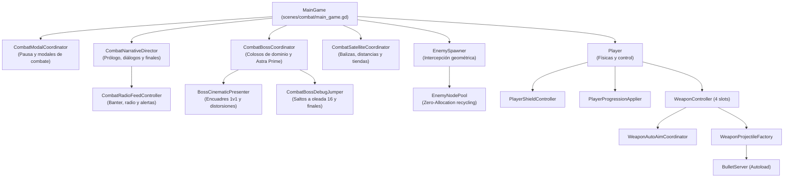
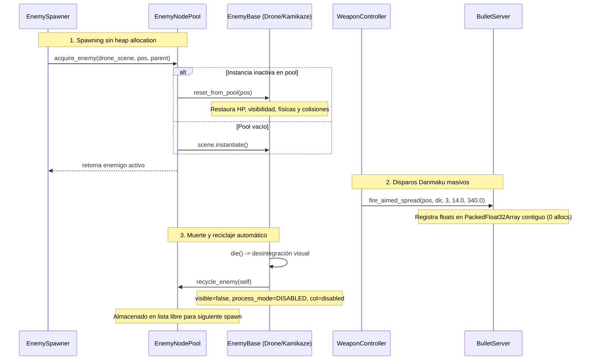

# Guía y Árbol Maestro Zero-Context — Astra Dream

> **Propósito:** Este documento proporciona una visión integral, exhaustiva y autosuficiente de la arquitectura del proyecto Astra Dream (Godot 4.7.2+). Está diseñado para permitir a cualquier desarrollador o agente de Inteligencia Artificial operar con **Zero Context** (arranque en frío sin necesidad de inferir dependencias o leer archivos fuente a ciegas).

---

## 1. Manifiesto y Pilares Arquitectónicos

1. **Zero-Allocation en Combate:**
   - **Danmaku Masivo:** Todo proyectil se gestiona mediante [`core/autoloads/bullet_server.gd`](file:///c:/Users/Frani/.gemini/antigravity/scratch/astra_dream/core/autoloads/bullet_server.gd) usando buffers contiguos de floats (`PackedFloat32Array`) y `MultiMeshInstance2D`. Prohibido instanciar `Area2D` para proyectiles.
   - **Enjambres de Enemigos:** Todo mob masivo (`drone`, `kamikaze`, `micro_flock`) se reutiliza mediante [`scenes/combat/enemies/enemy_node_pool.gd`](file:///c:/Users/Frani/.gemini/antigravity/scratch/astra_dream/scenes/combat/enemies/enemy_node_pool.gd) y `EnemyBase.reset_from_pool()`. Prohibido el ciclo continuo de `.instantiate()` / `.queue_free()` que provoque pausas de recolección de basura (GC pauses).
   - **Compactación de Gemas EXP:** [`ExpBlob`](file:///c:/Users/Frani/.gemini/antigravity/scratch/astra_dream/scenes/combat/pickups/exp_blob.gd) compacta automáticamente cristales lejanos (>950 px) en Mega-Cristales cuando la cuenta supera 60 ítems.

2. **Modularidad Radical (Anti God-Objects):**
   - Límite máximo objetivo por script: **< 500-600 LOC**.
   - Prohibido concentrar responsabilidades dispares en la escena raíz (`main_game.gd`, `hub_world.gd`, `player.gd`).
   - La escena raíz actúa como mero director orquestador delegando la lógica en coordinadores y controladores de nodo o `RefCounted`.

3. **Arquitectura Data-Driven Estricta:**
   - El 100% de las variables de balance, daño, vida, cadencia, escalado, curvas de oleada y precios residen en archivos de recursos exportados `.tres` (`WeaponData`, `CharacterData`, `WaveScheduleConfig`, `SectorData`).
   - Prohibido hardcodear números mágicos en scripts `.gd`.

4. **Tipado Estricto GDScript 4:**
   - Tipado estricto obligatorio en variables miembro, variables locales, parámetros y tipos de retorno (`func f() -> void:`, `var x: float = 0.0`).

5. **Infraestructura de Autoloads Pura:**
   - Autoloads reservados exclusivamente a servicios globales de infraestructura: `SaveManager`, `AudioManager`, `EventBus`, `SettingsManager`, `DebugManager`. Prohibido colocar lógica de combate o entidades dentro de autoloads.

---

## 2. Árbol Completo de Archivos y Responsabilidades

```
astra_dream/
├── .agents/                               # Reglas y contratos de desarrollo para agentes IA
│   └── rules/
│       ├── core_rules.md                  # 7 Reglas maestras (Zero-Allocation, Modularidad, Tipado, etc.)
│       ├── architecture_data.md           # Reglas de recursos .tres y composición
│       ├── combat_contracts.md            # Contratos HitContext, take_damage y grupos
│       ├── gdscript_style.md              # Convenciones de estilo GDScript 4.7+
│       └── git_workflow.md                # Protocolo de cuestionarios interactivos (ask_question)
│
├── core/                                  # Núcleo de infraestructura y sistemas independientes de escena
│   ├── autoloads/                         # Autoloads globales (Servicios puros)
│   │   ├── audio_manager.gd               # Gestión de canales de audio, BGM, SFX y fatiga auditiva
│   │   ├── bullet_server.gd               # Servidor de Danmaku masivo Zero-Allocation (PackedFloat32Array)
│   │   ├── debug_manager.gd               # Banderas y herramientas globales de depuración
│   │   ├── event_bus.gd                   # Bus reactivo de señales desacopladas entre subsistemas
│   │   ├── save_manager.gd                # Fachada estática de persistencia delegando en submódulos
│   │   └── settings_manager.gd            # Ajustes gráficos, volumen, atajos y zonas muertas
│   │
│   ├── entities/                          # Entidades base y contratos de combate
│   │   ├── character_stats.gd             # Sistema de atributos dinámicos y modificadores aditivos/mult
│   │   ├── hit_context.gd                 # DTO fuertemente tipado de impactos (daño, crit, proc_coeff)
│   │   └── player_stats_resource.gd       # Recurso de configuración de atributos de personaje
│   │
│   └── systems/                           # Sistemas de backend del juego
│       ├── cosmetics_manager.gd           # Catálogo de skins, rarezas y paletas shader
│       └── persistence/                   # Submódulos de almacenamiento modular en disco
│           ├── active_run_storage.gd      # Serialización de partida activa mid-run y highscores
│           ├── meta_progression_state.gd  # Estado de economía meta (biomasa, antimateria, trofeos)
│           ├── profile_storage.gd         # Almacenamiento seguro de perfil de usuario
│           ├── save_cosmetics_module.gd   # Persistencia de skins adquiridas y pity de gacha
│           └── save_roster_module.gd      # Desbloqueos de heroínas, navegantes, mascotas y finales
│
├── data/                                  # Recursos Data-Driven (.tres) — Balance sin números mágicos
│   ├── balance/                           # Configuración de oleadas y encuentros
│   │   ├── default_wave_schedule.tres     # Cronograma de oleadas 1-16 (límites, intervalos y curvas)
│   │   ├── wave_schedule_config.gd        # Clase del recurso de cronograma
│   │   └── wave_spawn_config.gd           # Clase de configuración individual por oleada
│   ├── characters/                        # Roster de Heroínas
│   │   ├── character_data.gd              # Clase maestra de personaje
│   │   ├── character_skin_data.gd         # Clase de skins y cromas
│   │   └── roster/                        # Recursos de las 8 pilotos (Nova, Valentina, Kira, Selene, Roxy, Echo, Nyx, Caelia)
│   ├── weapons/                           # Roster de Armas
│   │   ├── weapon_data.gd                 # Definición de arma (daño base, cadencia, escala de nivel)
│   │   ├── weapon_instance_data.gd        # Estado en tiempo de ejecución del arma
│   │   ├── roster/                        # Armas insignia de pilotos (Rail Launcher, Tesla Arc, etc.)
│   │   └── shop/                          # Armas adquiribles en satélites
│   ├── items/                             # Ítems pasivos y consumibles
│   │   ├── item_data.gd                   # Definición de ítem pasivo
│   │   └── roster/                        # 24 ítems pasivos de tienda orbital con tradeoffs
│   ├── arcanas/                           # Monolitos y bendiciones arcanas
│   ├── navigators/                        # Copilotos tácticos con pasivas globales
│   ├── pets/                              # Mascotas de combate y soporte táctico
│   ├── planets/                           # Configuración procedural de planetas de fondo
│   ├── sectors/                           # Sectores de campaña y modificadores cósmicos
│   └── skill_trees/                       # Árboles de talentos permanentes
│
├── scenes/                                # Árbol de escenas y lógica visual/interactiva
│   ├── combat/                            # Núcleo de Combate Espacial 2D
│   │   ├── main_game.gd / .tscn           # Orquestador raíz de combate (delega en coordinadores)
│   │   │
│   │   ├── directors/                     # Directores de flujo y cinemáticas
│   │   │   ├── combat_boss_coordinator.gd # Ciclo de vida y duelos de colosos de dominio
│   │   │   ├── combat_boss_debug_jumper.gd# Telemetría debug y saltos a oleada 16 / finales
│   │   │   ├── combat_narrative_director.gd# Control de prólogo, pausas y flujo de timelines
│   │   │   └── combat_radio_feed_controller.gd# Generación de diálogos Dialogic, alertas y banter
│   │   │
│   │   ├── bosses/                        # Jefes Titánicos y Rivales
│   │   │   ├── boss_cinematic_presenter.gd# Encuadre cinemático horizontal, rotación y distorsión
│   │   │   ├── boss_mothership.gd / .tscn # Jefe Nodriza estándar
│   │   │   ├── boss_hermit_void.gd        # Jefe Dominio Aislamiento (Oleada 2)
│   │   │   ├── boss_ash_clock.gd          # Jefe Dominio Arrepentimiento (Oleada 4)
│   │   │   ├── boss_broken_mirror.gd      # Jefe Dominio Disociación (Oleada 6)
│   │   │   ├── boss_overflow_vortex.gd    # Jefe Dominio Agobio (Oleada 8)
│   │   │   ├── boss_astra_prime.gd        # Jefe Supremo Final (Oleada 11/16)
│   │   │   ├── rival_pilot_boss.gd        # Duelos 1v1 con pilotos rivales de la Flota
│   │   │   ├── rival_warp_presenter.gd    # Presentador de portales y saltos hiperespaciales
│   │   │   ├── rival_combat_pattern_executor.gd# Ejecutor de patrones Danmaku de rivales y drops
│   │   │   └── hyperspace_portal.gd       # Vórtice procedural de hipersalto
│   │   │
│   │   ├── enemies/                       # Mobs comunes y pools Zero-Allocation
│   │   │   ├── enemy_base.gd              # Clase base común de enemigos (salud, drops, retroceso)
│   │   │   ├── enemy_node_pool.gd         # Pool de reciclaje en memoria (Zero-Allocation)
│   │   │   ├── enemy_spawner.gd           # Spawner de alta densidad con intercepción geométrica
│   │   │   ├── enemy_drone.gd / .tscn     # Drones básicos de persecución
│   │   │   ├── enemy_kamikaze.gd / .tscn  # Enemigo de asalto con turbo-embestida
│   │   │   ├── enemy_micro_flock.gd / .tscn# Micro-enjambre ágil en formaciones sinusoidales
│   │   │   ├── enemy_shooter.gd           # Artillero a distancia
│   │   │   ├── enemy_tank.gd              # Tanque acorazado
│   │   │   ├── enemy_splitter.gd          # Enemigo que se divide al morir
│   │   │   └── rainbow_enemy.gd           # Loot Goblin (Nave Arcoíris) de recompensa
│   │   │
│   │   ├── player/                        # Controlador del Jugador
│   │   │   ├── player.gd / .tscn          # Nave jugadora (físicas, movimiento, interacciones)
│   │   │   ├── player_shield_controller.gd# Regeneración, absorción y feedback de escudo
│   │   │   ├── player_progression_applier.gd# Aplicación de atributos y árbol de talentos
│   │   │   ├── weapon_controller.gd       # Gestor de las 4 ranuras de armas activas
│   │   │   ├── weapon_auto_aim_coordinator.gd# Auto-apuntado y priorización de amenazas
│   │   │   └── weapon_projectile_factory.gd# Despacho de balas físicas hacia BulletServer
│   │   │
│   │   ├── systems/                       # Coordinadores de subsistemas de combate
│   │   │   ├── combat_satellite_coordinator.gd# Ciclo de satélites, tiendas orbitales y distancias
│   │   │   ├── combat_telemetry_recorder.gd# Recopilación de estadísticas de fin de partida
│   │   │   └── run_state_serializer.gd    # Guardado y restauración de partida mid-combat
│   │   │
│   │   ├── satellite/                     # Balizas orbitales y tiendas
│   │   │   ├── satellite_beacon.gd        # Baliza interactiva en el mundo
│   │   │   ├── satellite_shop.gd          # Tienda orbital de ítems y reciclaje
│   │   │   └── slot_machine_beacon.gd     # Baliza de azar cósmico
│   │   │
│   │   ├── pickups/                       # Colectables de campo
│   │   │   ├── exp_blob.gd / .tscn        # Gema de EXP con compactación automática
│   │   │   ├── field_consumable.gd        # Consumibles de campo (Curación, Imán, Bomba)
│   │   │   └── rival_weapon_pickup.gd     # Cápsula de arma insignia otorgada por rivales
│   │   │
│   │   ├── environment/                   # Entorno espacial y planetas
│   │   │   ├── game_camera_2d.gd          # Cámara dinámica con trauma shake y zoom cinemático
│   │   │   ├── planet_segment.gd          # Renderizado de planetas procedurales
│   │   │   └── planet_spawner_helper.gd   # Distribución de fondos cósmicos
│   │   │
│   │   └── ui/                            # Interfaces de combate
│   │       ├── combat_hud.gd / .tscn      # HUD (barras de vida, minimapa, armas, jefes)
│   │       ├── combat_modal_coordinator.gd# Coordinador de modales que pausan el combate
│   │       ├── boss_edge_indicator.gd     # Indicador de colosos fuera de pantalla
│   │       └── level_up/                  # Modal de subida de nivel
│   │           ├── level_up_modal.gd      # Presentación del deck de subida de nivel
│   │           ├── card_builder.gd        # Constructor visual de cartas de opción
│   │           └── stats_inspector.gd     # Inspector de variaciones numéricas de atributos
│   │
│   └── ui/                                # Hangar 3D y Menús Fuera de Combate
│       ├── hub/                           # Hangar Espacial 3D
│       │   ├── hub_world.gd / .tscn       # Orquestador del Hangar 3D en tercera persona
│       │   ├── hub_player_controller_3d.gd# Movimiento en tercera persona del piloto
│       │   ├── components/                # Componentes modulares del Hangar 3D
│       │   │   ├── hub_hangar_builder_3d.gd# Construcción procedural de geometría del hangar
│       │   │   ├── hub_terminal_manager.gd# Terminales de interacción (Despliegue, Gacha)
│       │   │   ├── hub_interactions_coordinator.gd# Despacho de modales desde el hangar
│       │   │   └── hub_pilot_showcase_controller.gd# Iluminación y pasarela de skins 3D
│       │   ├── character_skill_tree_modal.gd# Modal del árbol de talentos permanentes
│       │   └── trophy_room_modal.gd       # Sala de trofeos y logros
│       │
│       ├── character_select/              # Despliegue y selección táctica
│       │   ├── character_select.gd        # Menú de selección de heroínas
│       │   ├── navigator_selection_modal.gd# Selección de copiloto
│       │   ├── pet_selection_modal.gd     # Selección de mascota acompañante
│       │   └── components/                # Componentes modulares de selección
│       │       ├── character_selection_cover_flow.gd# Animación CoverFlow de tarjetas
│       │       └── character_selection_dossier.gd# Panel de bio, atributos y pasivas
│       │
│       ├── gacha/                         # Sistema de gachapón cosmético
│       │   └── gacha_modal.gd             # Ruleta y animación de recompensas
│       ├── sector_select/                 # Selector de sector cósmico
│       │   └── sector_selection_modal.gd  # Selección de ruta y peligro
│       ├── game_over/                     # Fin de Partida
│       │   └── game_over_modal.gd         # Pantalla de victoria o derrota con telemetría
│       └── debug/                         # Herramientas del Desarrollador
│           └── debug_menu_modal.gd        # Panel debug de oleadas, saltos, unlocks y resets
│
└── tests/                                 # Infraestructura de Pruebas Automatizadas Headless
    ├── test_enemy_spawner_data_driven_runner.tscn # Runner del spawner y EnemyNodePool
    ├── test_enemy_spawner_data_driven_suite.gd    # Suite de balance y reciclaje Zero-Allocation
    ├── test_boss_runner.tscn                      # Runner de la Nodriza y HUD
    ├── test_boss_suite.gd                         # Suite de colosos y barras de salud
    ├── test_domain_bosses_runner.tscn             # Runner de los 4 colosos de dominio
    ├── test_domain_bosses_suite.gd                # Suite de colosos de dominio
    ├── test_narrative_and_rival_pilots_runner.tscn# Runner de narrativa y duelos de rivales
    ├── test_narrative_and_rival_pilots_suite.gd   # Suite de rivales, decisiones y 3 finales
    ├── test_prealpha5_runner.tscn                 # Runner de validación de secretos y meta
    ├── test_prealpha5_suite.gd                    # Suite de Nyx, talentos y persistencia
    └── test_character_dashes_runner.tscn          # Runner de mecánicas de pilotos y dashes
```

---

## 3. Diagramas de Flujo y Arquitectura de Subsistemas

### 3.1 Orquestación de Combate (`MainGame`)



### 3.2 Ciclo Zero-Allocation: Danmaku y Enjambres



---

## 4. Contratos de Interfaz Clave

### 4.1 Contrato `HitContext` y Daño Universal
Toda entidad vulnerable implementa:
```gdscript
func take_damage(arg: Variant) -> void:
    var dmg: float = 0.0
    var is_crit: bool = false
    if arg is HitContext:
        dmg = arg.final_damage
        is_crit = arg.is_crit
    elif arg is float or arg is int:
        dmg = float(arg)
    # Lógica de mitigación, reducción de vida y registro en DamageAccumulator
```

### 4.2 Grupos Obligatorios de Nodos
- `"player"`: Nodo del jugador principal (detectado por enemigos y satélites).
- `"enemies"`: Toda entidad hostil activa (escaneada por `WeaponAutoAimCoordinator`).
- `"bosses"`: Colosos principales de oleada (activan barras de vida y pausan spawners comunes).
- `"rival_pilots"`: Pilotos en duelo 1v1.
- `"exp_blobs"`: Gemas de experiencia (succionadas por `trigger_global_magnet`).

---

## 5. Recetas de Extensión (Zero-Context Recipes)

### Cómo Añadir un Nuevo Enemigo
1. Crear escena heredada de `scenes/combat/enemies/enemy_base.tscn`.
2. Asignar script que extienda de `EnemyBase` (`class_name EnemyX extends EnemyBase`).
3. En `_init()`, definir `enemy_id`, `max_health`, `move_speed`, `contact_damage` y `exp_reward`.
4. Sobrescribir `_update_behavior(delta: float)` para movimiento y ataque.
5. El enemigo es automáticamente compatible con `EnemyNodePool` sin código extra.

### Cómo Añadir una Nueva Arma
1. Crear un recurso `res://data/weapons/roster/mi_arma.tres` de tipo `WeaponData`.
2. Configurar en el inspector: `weapon_name`, `base_damage`, `attack_interval`, `projectiles_per_shot`.
3. Asignar la textura de icono y proyectil.
4. Agregar el recurso al inventario de una heroína en `CharacterData` o en la tienda satelital.

### Cómo Ejecutar la Suite de Pruebas Headless
En PowerShell, desde la raíz del proyecto:
```powershell
$godot = (Get-Command *godot*.exe).Source
& $godot --headless --path . tests/test_enemy_spawner_data_driven_runner.tscn
```
El test retornará `EXIT CODE: 0` si todos los contratos y aserciones son válidos.
