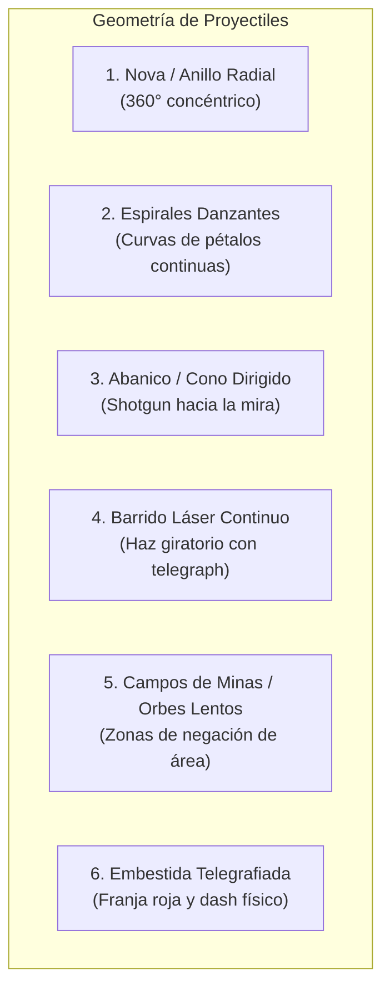

# GUÍA DE DISEÑO DE ENEMIGOS, JEFES Y PATRONES DE ATAQUE // ASTRA DREAM
> **Documento de Especificación Creativa, Arquetipos de Amenazas y Geometría Bullet Hell para el Artista**  
> *Versión 1.0 — Área de Arte, Combate y Diseño de Encuentros*

---

## 1. FILOSOFÍA DE LAS AMENAZAS EN ASTRA DREAM

En *Astra Dream*, el combate es un **ballet táctico a 360° en gravedad cero**. A diferencia de los shoot'em ups tradicionales de pantalla fija (donde las amenazas siempre bajan desde arriba), aquí el peligro puede converger desde cualquier coordenada del vacío.

Para que este caos sea divertido, justo y visualmente adictivo, el diseño artístico de los enemigos debe cumplir con un principio sagrado:
> **"La silueta y los puntos de luz del enemigo deben delatar su comportamiento antes de que dispare."**

El jugador solo tiene fracciones de segundo para priorizar blancos en medio de una nube de 80 entidades. Si un enemigo va a embestir, su cuerpo debe parecer una punta de lanza; si va a disparar un rayo continuo, debe tener una óptica masiva o acumulador visible; si va a dividirse, debe tener una estructura segmentada o inestable.

---

## 2. ARQUETIPOS DE ENEMIGOS: COMPORTAMIENTO Y SILUETA

Aún quedan muchos enemigos por crear, pero todos los diseños futuros deben encajar o combinar uno de estos arquetipos fundamentales:

```
[ CHAFF / ENJAMBRE ]       [ KAMIKAZE ]              [ SNIPER / ARTILLERO ]
  Números masivos,           Punta de flecha,          Ópticas largas,
  siluetas pequeñas,         propulsor sobredimensionado, torretas giratorias,
  movimiento ondulante.      brillo de ignición hostil.  disparo perimetral.

[ TANQUE / JUGGERNAUT ]    [ SPLITTER / REPLICANTE ] [ SOPORTE / RESONADOR ]
  Geometría pesada,          Núcleos fracturados,      Geometría geométrica flotante,
  escudos frontales,         silueta biológica/líquida, auras de lazo energético,
  movimiento lento e implacable. desove al destruirse. escudos a aliados.
```

---

### 2.1. El Enjambre / Chaff (Micro-Flocks, Drones Ligeros)
* **Función Jugable:** Enemigos débiles de 1 impacto que inundan la pantalla en grupos de 10 a 30 unidades. Su objetivo no es matar de un golpe, sino restringir el espacio de maniobra del jugador y forzar el uso de armas de área, perforación o dashes.
* **Silueta y Pistas Visuales:** Formas triangulares pequeñas, insectoides o micro-drones esféricos. Sin extremidades complejas para no sobrecargar el renderizado cuando hay cientos en pantalla.

### 2.2. El Kamikaze / Misil Viviente (Dive-Bomber)
* **Función Jugable:** Al entrar en rango medio, emiten una alerta sonora/lumínica, bloquean su vector hacia el jugador y aceleran en línea recta a velocidad extrema para detonar al contacto.
* **Silueta y Pistas Visuales:** Silueta en cuña o arpón aerodinámico. Deben tener un motor o tobera trasera enorme que pase de un brillo latente a una llamarada cegadora cuando inician la embestida (*telegraph* de carga).

### 2.3. El Tirador de Precisión / Artillero Perimetral (Sniper & Turret)
* **Función Jugable:** No persiguen al jugador; se mantienen orbitando en el borde de la pantalla (fuera del alcance de armas cortas) y disparan proyectiles veloces o rayos lásers.
* **Silueta y Pistas Visuales:** Cañones desproporcionadamente largos, antenas de telemetría y una mira holográfica frontal que proyecta una línea tenue roja o violeta en el suelo espacial antes de disparar.

### 2.4. El Blindado / Juggernaut (Tanques Espaciales)
* **Función Jugable:** Esponjas de daño con armadura que avanzan implacables. Suelen disparar abanicos pesados o proyectiles explosivos que obligan al jugador a rodearlos.
* **Silueta y Pistas Visuales:** Formas masivas, ángulos facetados, placas de blindaje pesado en el frente y un punto débil visible en la espalda (núcleo térmico, ventilación o baterías expuestas).

### 2.5. El Replicante / Splitter
* **Función Jugable:** Al ser destruido, no deja botín inmediato: se fractura en 2 o 4 sub-unidades más pequeñas y rápidas, atrapando al jugador que no calculó el espacio tras detonarlo.
* **Silueta y Pistas Visuales:** Aspecto inestable: cristales agrietados, biomasa gelatinosa en tensión o mechas modulares unidos por campos magnéticos que vibran antes de fragmentarse.

### 2.6. Los Nodos de Resonancia / Búferes
* **Función Jugable:** Enemigos que no atacan directamente pero hacen invulnerables a los demás mediante rayos de anclaje, curan en área o proyectan barreras de energía entre sí que dañan al cruzar.
* **Silueta y Pistas Visuales:** Siluetas arcanas o prismáticas (octaedros flotantes, monolitos menores, boyas orbitales emisoras) con filamentos de luz continuos conectados a sus aliados.

---

## 3. CATÁLOGO DE PATRONES DE ATAQUE (*BULLET HELL*)

En un shooter espacial, la variedad de los combates proviene de cómo los enemigos pintan el espacio con proyectiles. Aquí están los patrones arquetípicos que el artista debe conocer para diseñar los emisores de armas, lásers y telegraphs:



### 1. El Anillo Radial / Nova Expansiva (360°)
* **Mecánica:** El enemigo o jefe emite una onda circular de 16, 32 o 64 balas equidistantes que se expanden hacia afuera.
* **Cómo lo esquiva el jugador:** Buscando el espacio entre proyectiles a medida que el radio crece, o usando un dash con frames de invulnerabilidad para atravesar el anillo.
* **Visual:** Bolas de energía o agujas de plasma con núcleo blanco y halo de color temático.

### 2. La Espiral Danzante (Curvas y Pétalos)
* **Mecánica:** Múltiples bocas de fuego giran continuamente sobre el eje del enemigo, generando brazos de espiral que barren la pantalla (inspiración directa de *Touhou* e *Ikaruga*).
* **Cómo lo esquiva el jugador:** Orbitando al compás del giro del jefe o manteniendo una distancia precisa.

### 3. El Abanico Focalizado (Spread / Cono de Escopeta)
* **Mecánica:** Ráfagas de 3 a 7 balas disparadas en ángulo cónico directamente hacia la posición del jugador.
* **Cómo lo esquiva el jugador:** Desplazamiento lateral rápido (strafe) o retroceso con dash.

### 4. El Haz Continuo de Barrido (Beam Sweeps)
* **Mecánica:** Primero aparece una **línea de advertencia tenue (*Laser Sight*)** durante 1 segundo indicando la trayectoria. Luego, se enciende un rayo láser continuo demoledor que gira 45° o 90° barriendo el sector.
* **Cómo lo esquiva el jugador:** Anticipando la línea guía y dasheando por encima del rayo antes de que impacte.

### 5. Zonas de Negación de Área y Orbes Gravitatorios
* **Mecánica:** Minas que permanecen flotando 10 segundos en el espacio, o campos de singularidad que aspiran al jugador si se acerca demasiado.
* **Cómo lo esquiva el jugador:** Control de navegación; no arrinconarse contra los peligros persistentes.

### 6. Embestidas Masivas Telegrafiadas
* **Mecánica:** El jefe proyecta una franja rectangular en el lienzo espacial que se ilumina gradualmente, seguido de una embestida que cruza la pantalla a hipervelocidad rompiendo todo a su paso.

---

## 4. JEFES Y TITANES CÓSMICOS: FASES Y ESCALA

Los jefes no son simplemente enemigos con mucha vida: **son espectáculos visuales de varias fases que transforman la dinámica de la arena**.

### 4.1. Anatomía de Fases en un Jefe:
1. **Fase 1 (Patrones Metódicos):** El jefe ataca con cadencia regular, permitiendo al jugador aprender su lenguaje visual y ritmo de disparo.
2. **Fase 2 (Enrage / Sobrecarga al <50% HP):**
   * **Cambio de Silueta Visual:** Placas de blindaje se desprenden revelando reactores sobrecalentados, se abren alas de plasma adicionales, o su paleta cromática vira a tonos incandescentes (rojo carmesí, púrpura abisal).
   * **Superposición de Patrones:** Ahora combina un barrido láser con un anillo de balas radial simultáneo.
3. **Fase Desesperada / Ataque Signature:** El jefe se traslada al centro o se vuelve invulnerable temporalmente mientras carga una supernova o lluvia masiva que el jugador debe sobrevivir.

### 4.2. Arquetipos de Jefes en Astra Dream:

| Arquetipo de Jefe | Inspiración / Sensación | Dinámica en Combate | Pistas de Diseño Artístico |
| :--- | :--- | :--- | :--- |
| **La Nave Nodriza / Super-Estructura** | *Gradius, R-Type, Star Fox* | Fortaleza flotante con torretas y compuertas independientes que el jugador va destruyendo por partes. | Placas de hangar colosales, baterías de artillería visibles, bahías de lanzamiento de cazas. |
| **El Titán del Vacío / Entidad Cósmica** | *Returnal, Bloodborne Cósmico* | Criatura biomecánica o astral gigantesca que nada en el espacio y deforma la gravedad. | Ojos cósmicos múltiples, tentáculos de filamento estelar, coronas de runas del Vacío. |
| **El Piloto Rival (Duelo de Ases)** | *Armored Core, Ace Combat, Vergil* | Un exo-traje de tamaño similar al del jugador que cuenta con sus propios dashes, escudos y armas signature. | Silueta estilizada, capa de propulsión de alta maniobrabilidad, estelas de postcombustión de color rival. |
| **La Anomalía Temporal / Arcano** | *Enter the Gungeon, Hades* | Jefes abstractos basados en conceptos (ej. *Ash Clock*, *Broken Mirror*) que alteran el flujo del tiempo o duplican proyectiles. | Geometría fractal, manecillas estelares flotantes, espejos que reflejan lásers. |

---

## 5. REFERENCIAS DE ORO DE LA INDUSTRIA (QUÉ APRENDER DE OTROS JUEGOS)

Para inspirar tus propuestas visuales, te recomendamos estudiar cómo resolvieron estos retos los mejores referentes del género:

* **Enter the Gungeon:**
  * *Lección:* **Telegrafía perfecta y expresividad.** Antes de cada ataque, los jefes tienen una pose de anticipación exagerada (inspirar antes de escupir fuego, levantar un arma pesada). El jugador sabe qué va a pasar 0.5 segundos antes de que salgan las balas.
* **Returnal:**
  * *Lección:* **Contraste de balas de neón en el espacio oscuro.** Proyectiles cian, magenta y naranja brillante con estelas de partículas que iluminan el entorno pero jamás pierden su silueta esférica definida.
* **NieR: Automata:**
  * *Lección:* **Fusión de orbes bullet hell con estética mecha/elegante.** Orbes rojos y púrpuras flotantes que conviven de forma poética y letal con robots oxidados y androides de combate estilizados.
* **Ikaruga / Touhou Project:**
  * *Lección:* **Patrones matemáticos florales.** Las balas no se disparan al azar; forman figuras geométricas armónicas (mandalas, espirales dobles, cortinas simétricas) que son tanto una obra de arte visual como un rompecabezas de evasión.
* **Risk of Rain 2:**
  * *Lección:* **Identificación instantánea de Élites.** Los enemigos élite se distinguen a kilómetros gracias a una corona o aura elemental muy contrastada (Glacial = cuernos de hielo, Sobrecarga = orbes eléctricos flotantes, Blazing = rastro de fuego).

---

## 6. PREGUNTAS CLAVE PARA EL ARTISTA

1. **¿Qué tecnología o biología utilizan los enemigos?**  
   * ¿Son autómatas de silicio de una civilización extinta? ¿Drones de seguridad corporativos? ¿Parásitos espaciales bioluminiscentes?
2. **¿Cuál es el código de color de los proyectiles hostiles?**  
   * Si las balas de las heroínas son cian, doradas y esmeraldas... ¿las balas enemigas deberían ser rojas, violetas y naranjas para garantizar contraste absoluto?
3. **¿Cómo se rompen los jefes al ser derrotados?**  
   * ¿Explosiones en cadena al estilo anime mecha clásico? ¿Disolución en polvo estelar o colapso hacia un micro-agujero negro?

---

> *¡Diseña enemigos que den gusto esquivar y jefes que sea un orgullo derrotar!*
