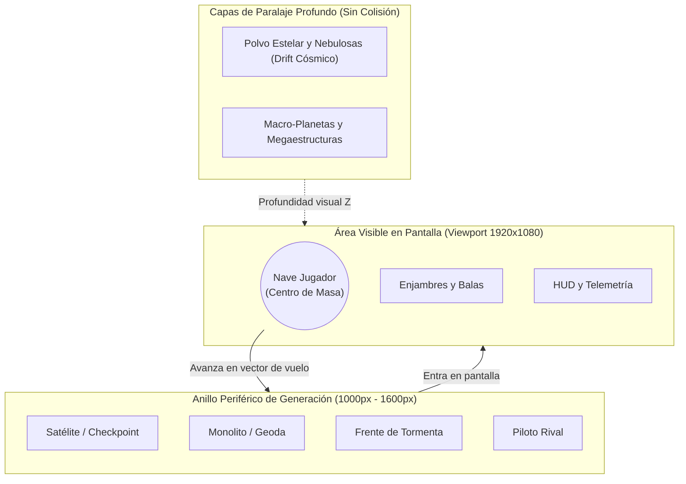

# GUÍA DE DIRECCIÓN DE ARTE // EL LIENZO Y LAS ANCLAS DE ASTRA DREAM
> **Documento de Diseño y Especificación Estructural para el Artista**  
> *Versión 1.0 — Área de Arte y Worldbuilding*

---

## 1. PROPÓSITO DE ESTE DOCUMENTO

El objetivo de esta guía **no es imponerte un estilo visual cerrado**, sino entregarte las **reglas del mundo, la física del motor y las anclas jugables** que hacen que *Astra Dream* funcione.

Queremos que tengas la libertad total de proponer la estética, la narrativa visual y las justificaciones temáticas de cada elemento (ya sea que decidas tirar hacia el *cyberpunk espacial*, el *sci-fi anime noventero*, la *ópera espacial con misticismo cósmico*, o una mezcla propia).

El único límite es que **el gameplay loop y la legibilidad táctica deben permanecer intocables**. Si entiendes el lienzo en el que pintas y respetas los pilares funcionales, cualquier idea visual que plasmes encajará a la perfección en el código sin requerir refactors de ingeniería.

---

## 2. EL LIENZO DE JUEGO: EL ESPACIO INFINITO 2D

### 2.1. ¿Cómo funciona el campo de batalla en el motor?
A diferencia de los shooters con arenas cerradas o scrolling forzado vertical/horizontal, en *Astra Dream* el jugador pilota en un **plano bidimensional 360° infinito**:
* **Sin muros físicos invisibles:** El jugador puede orientar su nave y acelerar en cualquier dirección de manera indefinida.
* **Cámara de seguimiento suave:** La cámara se centra continuamente en la nave del jugador, con un ligero retardo elástico (*camera smoothing*) para dar peso a la inercia del vuelo.
* **Spawning Periférico (Off-screen):** Los objetos no existen colocados estáticamente en un mapa predefinido; se generan proceduralmente en un anillo fuera del viewport (entre **1000 y 1600 píxeles** de distancia del jugador, frecuentemente proyectados en su vector de avance).
* **Despawning por Distancia:** Si el jugador ignora un objetivo o se aleja demasiado (ej. **10.000 píxeles** en el caso de los satélites), el objeto se recicla limpiamente en memoria y se prepara el siguiente.



---

## 3. LA ANATOMÍA POR CAPAS (Z-INDEX Y PROFUNDIDAD)

Para que el juego mantenga una profundidad espacial envolvente sin que los elementos de fondo se confundan con balas mortales, el renderizado se divide estrictamente en 4 estratos visuales:

```
[ FRONT / HUD ]       --> UI, barras de vida, retículas de apuntado, textos de radio.
[ COMBAT PLANE ]      --> Jugador, proyectiles, enemigos, EXP, satélites, monolitos (COLISIÓN FÍSICA).
[ MIDGROUND PROPS ]   --> Macro-planetas, siluetas de naves colosales lejanas, chatarra a la deriva (SIN COLISIÓN).
[ DEEP PARALLAX ]     --> Nebulosas, nubes de gas, campos de estrellas profundos con auto-drift constante.
```

### Regla Fundamental:
> **Todo lo que tenga colisión o daño DEBE habitar el plano de combate.**  
> Los elementos de capas inferiores (*Midground* y *Deep Parallax*) pueden ser visualmente gigantescos, pero deben mantener una paleta desaturada y baja emisión de luz para no engañar al cerebro del jugador creyendo que va a chocar contra ellos.

---

## 4. LAS 6 ANCLAS SAGRADAS DEL GAMEPLAY LOOP (NO NEGOCIABLES)

Cualquier propuesta visual debe encajar funcionalmente con estos 6 pilares de diseño:

### ⚓ Ancla 1: El Satélite Baliza (Checkpoint y Estación de Oleada)
* **Función Jugable:** Es el faro de avance de cada oleada (se generan hasta 3 por ronda). Aparece proyectado en la dirección en la que vuela el jugador. Al alcanzarlo, el jugador entra en su radio, se abre la tienda táctica de mejoras, se cobran recompensas y se avanza el ritmo de la partida.
* **El Reto Temático para el Artista:** ¿Qué es este satélite en tu universo?  
  * *¿Una boya de salto hiperespacial automatizada?*  
  * *¿Un dron de suministros de una megacorporación orbital?*  
  * *¿Un nodo de retransmisión hacker abandonado que descargas en caliente?*  
  * *¿Un altar de tecnología arcana que sintoniza con tu nave?*

### ⚓ Ancla 2: Monolitos y Macro-Objetos Destructibles
* **Función Jugable:** Estructuras flotantes con barras de vida generosas que demandan fuego concentrado. Al ser destruidas, liberan:
  * **Monolitos:** Pactos Arcanos que alteran las reglas del run (ej. ganar daño a costa de recibir más fuego).
  * **Geodas Astrales:** Cúmulos densos de gemas de EXP y minerales raros.
  * **Cápsulas de Suministro / Capullos:** Escudos temporales, créditos o nanobots de curación.
* **El Reto Temático para el Artista:** En lugar de simples cajas o rocas genéricas, ¿cómo justificas estas fuentes de botín? ¿Son meteoritos infusionados de energía del Vacío? ¿Cápsulas de salvamento selladas? ¿Fósiles orgánicos que han germinado en el espacio cero?

### ⚓ Ancla 3: Macro-Planetas y Mega-Cuerpos Celestes
* **Función Jugable:** Cada cierto kilometraje recorrido (ej. 4000 unidades), la cámara sobrevuela un planeta colosal. No tiene colisión física para no encerrar al jugador, pero genera una referencia espacial imponente.
* **El Reto Temático para el Artista:** Diseñar mundos con personalidad que cuenten historias al vuelo: planetas fracturados con núcleos expuestos, gigantes gaseosos con tormentas de plasma, o mundos colmena cibernéticos cubiertos de luces continentales.

### ⚓ Ancla 4: Navegadoras y Telemetría Táctica
* **Función Jugable:** Oficiales de enlace en cabina con radar especializado:
  * *Lyra* rastrea biomasa y planetas fértiles.
  * *Vespera* sintoniza con el éter y pactos del destino.
  * *Caelia* mide densidad geológica y monolitos de materia oscura.
  * *Zephyr* intercepta frecuencias de satélites y tiendas.
  * *Iris* atisba grietas dimensionales, anomalías cero y titanes.
* **El Reto Temático para el Artista:** La interfaz de telemetría debe sentirse integrada con su personalidad. Se usan líneas guía holográficas, retículas direccionales y widgets laterales de transmisión por radio con sus retratos de burbuja.

### ⚓ Ancla 5: Eventos de Crisis (Fenómenos Globales)
* **Función Jugable:** Situaciones de peligro ambiental que afectan a toda la pantalla durante 20-30 segundos:
  * **Tormenta Solar:** Pulso térmico y quemadura visual en bordes.
  * **Inversión de Vacío:** Ondas gravitatorias que alteran la velocidad.
  * **Nube Iónica:** Distorsión electromagnética e interferencia en radares.
  * **Lluvia de Meteoros:** Lluvia de proyectiles cinéticos pesados.
* **El Reto Temático para el Artista:** ¿Cómo transformar estos eventos en espectáculos visuales que comuniquen tensión inmediata sin ensuciar la visibilidad de las balas?

### ⚓ Ancla 6: Enjambres, Rivales y Jefes Titánicos
* **Función Jugable:** Hordas de enemigos con patrones geométricos, pilotos rivales de duelo 1v1 y Titanes de final de oleada con fases y proyectiles masivos (*Bullet Hell*).
* **El Reto Temático para el Artista:** Siluetas legibles a primera vista. Debes poder distinguir un enemigo suicida (*kamikaze*) de una torreta pesada o un splitter por su silueta y emisión de luz, incluso cuando hay 80 naves simultáneas en pantalla.

---

## 5. LA REGLA DE ORO: JERARQUÍA DE CONTRASTE Y LEGIBILIDAD

En un juego de supervivencia espacial de alta velocidad, la belleza artística nunca debe entorpecer el tiempo de reacción reflejo del jugador.

Para lograr esto, aplicamos la **Jerarquía Visual de 4 Niveles de Prioridad Lumínica**:

| Nivel | Elementos | Tratamiento Visual y Regla de Contraste |
| :--- | :--- | :--- |
| **Nivel 1 (Máxima Alerta)** | Balas enemigas, lásers, zonas de peligro (*telegraphs*), misiles entrantes. | Colores de altísima saturación y valor (rojos, magentas, naranjas incandescentes, blancos puros de núcleo). Deben "perforar" cualquier fondo. |
| **Nivel 2 (Control Táctico)** | Nave del jugador, hitbox central, compañero felino/pet, proyectiles propios. | Iluminación limpia, silueta recortada, brillo cian/verde/oro según el piloto seleccionado. |
| **Nivel 3 (Recompensa)** | Gemas de EXP, núcleos de crédito, cajas de botín, pickups. | Brillo titilante con resplandor neón suave; diferenciables por tono y forma para no confundirse con proyectiles mortales. |
| **Nivel 4 (Escenografía)** | Nebulosas, estrellas, macro-planetas, polvo estelar, restos de fondo. | Tonos oscuros, paletas frías o desaturadas, bajo contraste dinámico. **Nunca** uses partículas de fondo que parezcan proyectiles enemigos. |

---

## 6. IDEAS DE INSPIRACIÓN: CÓMO CREAR "REGIONES" Y "BIOMAS" SIN PAREDES

Uno de los mayores desafíos creativos es: **¿Cómo hacer que un espacio infinito no se sienta como una sopa negra homogénea, sin añadir paredes que rompan la libertad de vuelo?**

Aquí tienes 4 propuestas conceptuales sobre las que puedes construir:

### Propuesta A: Sobrevolar Megaestructuras en Paralaje Profundo (El "Falso Terreno")
* En lugar de que el fondo sea siempre el vacío estelar infinito, en ciertas oleadas o fases el fondo del juego muestra que estamos volando sobre la superficie de algo inmenso:
  * Sobrevolar la cubierta blindada de una estación Dyson de 1000 km de largo (torres de refrigeración, conductos de plasma y antenas gigantes pasando por debajo de nuestra nave).
  * Sobrevolar la atmósfera superior de un Gigante Gaseoso púrpura con nubes turbulentas a gran velocidad.
  * **Efecto:** Da la sensación de "estar en un nivel terrestre o de trinchera", pero conservando 100% el vuelo libre sin colisiones contra el suelo.

### Propuesta B: Arrecifes Cósmicos y Ecosistemas en Gravedad Cero
* Ciertas regiones pueden estar dominadas por biomas orgánicos o minerales suspendidos:
  * Nubes de polen estelar y raíces de bio-organismos espaciales que florecen en el vacío.
  * Bosques de cristales flotantes o meteoritos unidos por filamentos de plasma gravitatorio.
  * Los enemigos de esta zona adoptan siluetas biomecánicas o de crustáceos/medusas estelares.

### Propuesta C: Cementerios de Flotas y Cinturones de Chatarra
* Un bioma dominado por la guerra pasada: esqueletos oxidados de cruceros de batalla partidos en dos, módulos habitacionales a la deriva y nubes de metralla fría.
* La paleta se vuelve cobriza, ceniza y cian apagado, con chispazos eléctricos residuales.

### Propuesta D: Distorsión del Vacío / Dimensión Cero (Fases Avanzadas)
* A medida que sube la dificultad, el universo se desgaja: el fondo se vuelve geométrico, abstracto, con auroras fractales y grietas cromáticas que responden a los ataques de los Titanes.

---

## 7. PREGUNTAS CLAVE PARA EL ARTISTA (TU ESPACIO CREATIVO)

Al abordar este proyecto, te invitamos a reflexionar sobre estas preguntas para definir la personalidad de *Astra Dream*:

1. **¿Qué tipo de energía mueve a estas naves?**  
   * ¿Combustión química estilizada con reactores de plasma? ¿Motores de antimateria o cristales arcanos resonantes?
2. **¿Quiénes son las facciones enemigas?**  
   * ¿Son flotas rebeldes de IA descontrolada? ¿Entidades del vacío que consumen estrellas? ¿Enjambres orgánicos invasores?
3. **¿Cómo se siente la cabina de nuestras heroínas?**  
   * ¿Tecnología limpia y militar de vanguardia? ¿Hacking underground con stickers y cables expuestos? ¿O una conexión psíquica/mística con la nave?
4. **¿Cómo evolucionará la paleta de color a lo largo de una run de 15 minutos?**  
   * ¿Empezamos en la serenidad del azul profundo y terminamos en el infierno ultravioleta de una grieta cósmica?

---

> *¡El lienzo es tuyo! Con estas anclas bien firmes, cualquier universo que construyas funcionará de forma impecable y memorable.*
