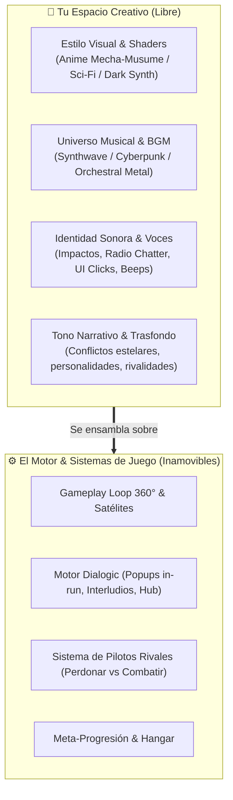
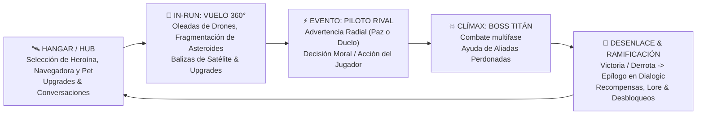
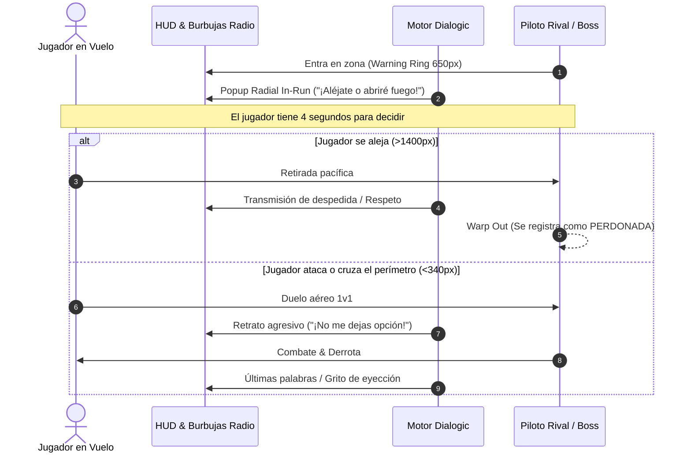
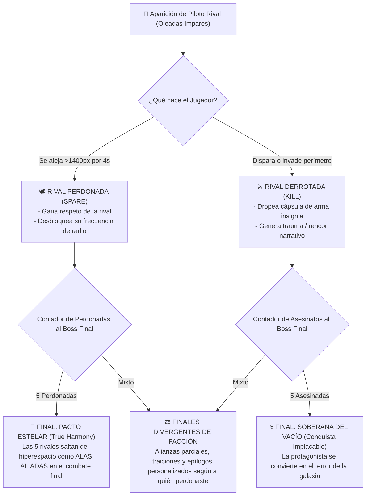
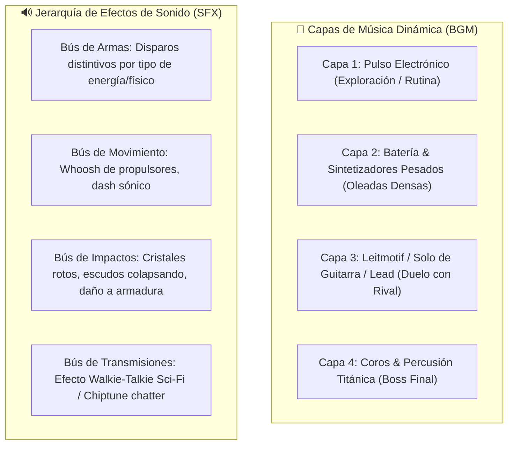

# 🎨 GUÍA MAESTRA CREATIVA: ESTÉTICA, NARRATIVA DIVERGENTE Y UNIVERSO AUDIOVISUAL
> **Destinatario:** Artista Principal, Diseñador Narrativo y Compositor / Diseñador de Audio  
> **Propósito:** Brindar **libertad creativa total** sobre la dirección artística, el estilo visual, la música y el diseño sonoro, proporcionando el mapa conceptual completo del producto: el gameplay loop, la integración con el motor de diálogos (*Dialogic*) y el sistema de combate/perdón de **Pilotos Rivales** como catalizador de ramificaciones narrativas y múltiples finales.

---

## 🧭 1. Manifiesto y Visión: Libertad Creativa con Anclaje Sistémico

Este documento corona la serie de guías previas (*Lienzo y Anclas*, *Personajes e Ítems*, *Enemigos y Jefes*). Tu rol no es simplemente "dibujar sprites o componer pistas sueltas", sino **definir el alma, el tono, la identidad sensorial y la emoción** de todo el universo de **Astra Dream**.

---

## 🔄 2. Anatomía del Producto: El Gameplay Loop Integral

Para que cada ilustración, shader, acorde musical y efecto de sonido encaje con precisión quirúrgica, este es el flujo de juego que experimenta el jugador:

### Fases del Ciclo y Oportunidades Creativas

| Fase | Qué ocurre mecánicamente | Oportunidad Visual / Artística | Oportunidad Musical / Audio |
| :--- | :--- | :--- | :--- |
| **1. Hangar / Hub** | Menús de selección, customización, upgrades de árbol de talentos, interacción social con heroínas, navegadoras y pets. | Ilustraciones de cuerpo entero sensuales/carismáticas (*Hub Outfits*), UI elegante con temática sci-fi, animaciones idle. | Música chill, ambient sci-fi o lo-fi espacial relajante; beeps de interfaz premium y satisfactorios. |
| **2. In-Run (Vuelo 360°)** | Movimiento inercial libre, recolección de cristales, oleadas crecientes, captura de satélites baliza. | Sprites de combate en vista cenital (*Exo-Suits Mecha-Musume* con propulsores reactivos), efectos de partículas vibrantes. | BGM de combate rítmico que sube de capas (*Stem dynamic audio*) según la densidad de proyectiles. |
| **3. Encuentro Rival (Oleadas Impares)** | Una piloto real aparece en el radar. Emite advertencia por radio; el jugador decide si acercarse o alejarse. | Anillo holográfico de advertencia, retrato de transmisión en HUD con glitch/estática, diseño de mecha personalizado para cada rival. | La música general se silencia y entra el **Stinger temático / Leitmotif personal de la Rival**. Ruido de radio chatter. |
| **4. Clímax: Boss Titán** | Jefes masivos con múltiples barras de vida, telegrafiado geométrico y fases destructivas. | Escala monumental, distorsión de pantalla (*chromatic aberration*), partes mecánicas desprendiéndose. | BGM épico de alta intensidad con percusión orquestal pesada y sintetizadores agresivos. |
| **5. Desenlace y Epílogo** | Pantalla de victoria/derrota, cálculo de puntos, diálogos de balance y epílogo según acciones. | Ilustraciones CG de recompensa (*End-of-run Event CGs*), arte de final desbloqueable. | Pista de resolución emotiva (triunfal, trágica o misteriosa según el final alcanzado). |

---

## 🎭 3. Integración con Dialogic: El Alma de las Interacciones

El proyecto utiliza **Dialogic 2** como motor narrativo. La narrativa no interrumpe bruscamente el frenesí arcade; se integra de tres formas diseñadas para enriquecer la experiencia sin frustrar:

### Canales Narrativos en Dialogic

1. **Burbujas de Radio In-Run (`Radio Transmission Popups`):**  
   Retratos circulares de las navegadoras o rivales que aparecen en los costados de la pantalla mientras vuelas. Informan sobre alertas, anomalías, satélites listos o provocaciones.
2. **Interludios de Cabina entre Oleadas (`Cockpit Interludes`):**  
   Ventana de 5 a 10 segundos de descanso donde la heroína conversa con su navegadora o su mascota (*Pet*) sobre el estado de la misión.
3. **Escenas de Novela Visual en el Hangar / Finales (`Full Visual Novel Dialogues`):**  
   Retratos de medio cuerpo o cuerpo completo con múltiples expresiones faciales (neutra, confiada, sonrojada, furiosa, herida), cuadros de texto detallados y fondos ilustrados.

---

## ⚔️ 4. Sistema de Pilotos Rivales: El Motor de Ramificación Narrativa

En las oleadas 1, 3, 5, 7 y 9 pueden emerger **Pilotos Rivales** (otras pilotos mecha con sus propias agendas y lealtades). Este sistema es la columna vertebral de la **divergencia de la historia**:

### Oportunidades de Diálogos Cruzados (*Cross-Heroine Matchups*)

Cada combinación de **Heroína Jugada vs Piloto Rival** es una mina de oro narrativa:
- **Astra vs Nyx:** Choque entre la luz de la rebelión y la sombra militar. Diálogos de camaradería rota o redención.
- **Ignis vs rival fría/estratega:** Duelo de personalidades (furia volcánica vs frialdad analítica).
- **Heroína con Mascota Activa:** Los Pets intervienen en los diálogos con ladridos, chillidos cibernéticos o comentarios cómicos que suavizan o acentúan la tensión.

---

## 🎧 5. Arquitectura y Dirección de Audio & Música

Tienes la libertad de definir la paleta de géneros sonoros. A continuación se presenta el marco técnico de integración con el `AudioManager` de Godot:

### Sugerencias de Estilo y Paletas Sonoras

1. **BGM / Soundtrack:**
   - *Exploración / Hub:* Synth-ambient atmosférico con notas cálidas de teclado o guitarras reverberadas.
   - *Combates Estándar:* Cyberpunk / Darksynth enérgico (estilo *Carpenter Brut*, *The Midnight* o *Nova Drift*).
   - *Pilotos Rivales:* Cada rival merece su propio riff temático (melodía insignia que el jugador reconoce al instante en cuanto entra la señal de radio).
2. **SFX & Feedback Táctil:**
   - **Sonido de Gemas / Cristales:** Cada gema de experiencia recolectada debe sonar como un tintineo cristalino en escala ascendente (sensación de dopamina pura al absorber enjambres de gemas).
   - **Telegrafiado de Ataques:** Los lásers titánicos y misiles teledirigidos de los jefes deben emitir un pitido de carga distintivo 0.8s antes de disparar para alertar al jugador por oído además de por vista.
   - **Radio Filter:** Las voces o beeps de diálogo de Dialogic pueden pasar por un bus de audio con filtro paso-altos (*High-pass filter*) y una ligera saturación analógica.

---

## 📋 6. Matriz de Entregables para el Equipo Creativo

| Categoría | Entregable Clave | Especificación Sugerida |
| :--- | :--- | :--- |
| **Heroínas (Hub & In-Run)** | 6 Heroínas Base + 1 Desbloqueable (Nyx) | Hub: Retratos full body (1080p+) con expresiones. In-Run: Spritesheets 360°/Direccionales (128x128 o 256x256). |
| **Navegadoras & Pets** | 5 Navegadoras + 5 Pets | Navegadoras: Bustos circulares (HUD Radio). Pets: Sprites flotantes de compañía (64x64) con animaciones idle/reacción. |
| **Pilotos Rivales** | Diseños de Mecha & Retratos de Radio | Retratos normales, hostiles, heridos y de respeto al ser perdonadas. |
| **Ítems & Satélites** | Iconos para las 12 estadísticas y satélites | Iconografía vector o pixel art de 64x64 con código de color unificado. |
| **Enemigos & Jefes** | 6 Arquetipos de Enjambre + 3 Titanes | Diseños con puntos débiles luminosos y animaciones de telegrafiado claras. |
| **BGM & Audio Packs** | Pistas de Hub, Biomas, Duelos de Rival y Bosses | Formato OGG en bucle sin costuras (*seamless loop*) + Stems por capas. |
| **SFX Pack** | Disparos, dashes, impactos, cristales, UI beeps | Formato WAV sin pérdida a 44.1kHz / 24-bit. |

---

## 🌟 7. Conclusión: El Universo es Tuyo

El motor está listo, los proyectiles vuelan fluidos a 60 FPS, los satélites orbitan y las pilotos esperan su voz, su aspecto y su música. Tienes las riendas para plasmar una estética inolvidable que convierta a **Astra Dream** en una joya de culto arcade tanto visual como auditiva y narrativa.
