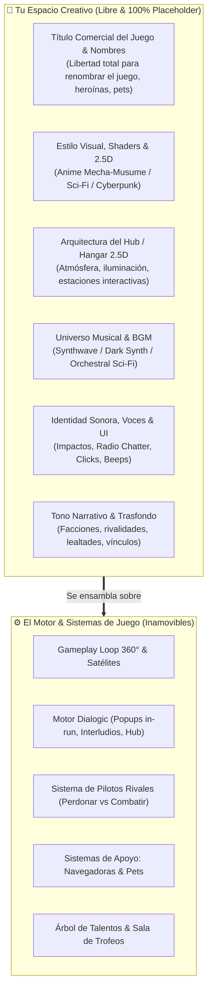
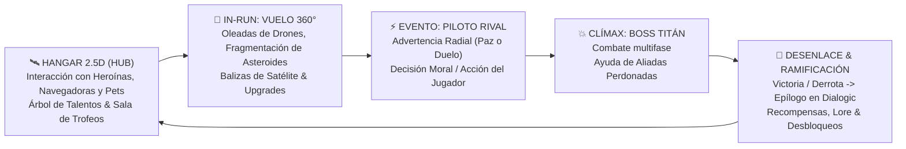
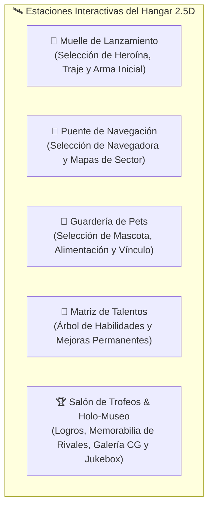
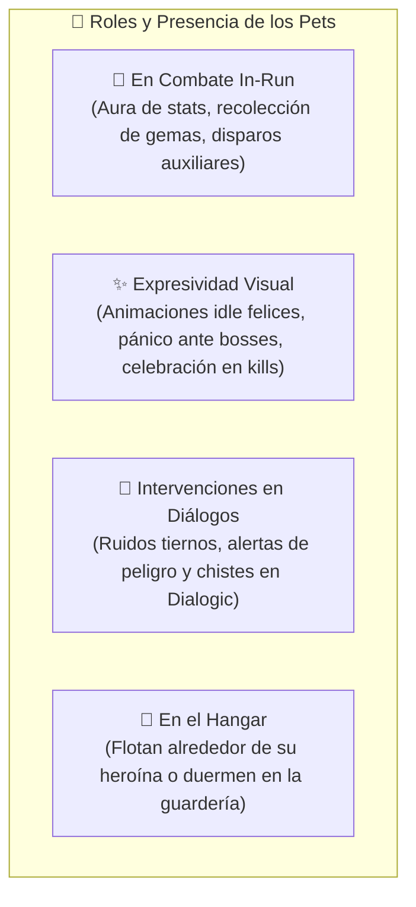
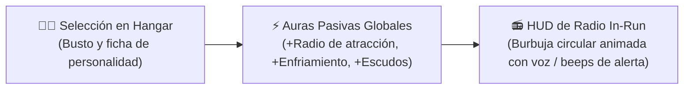
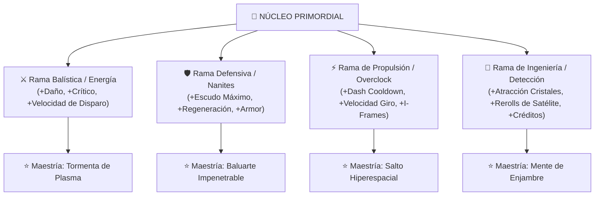
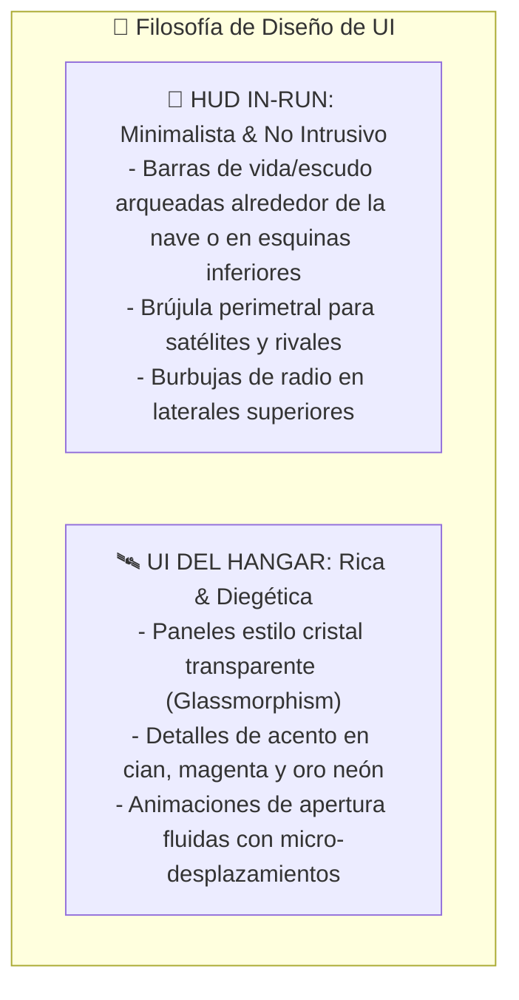
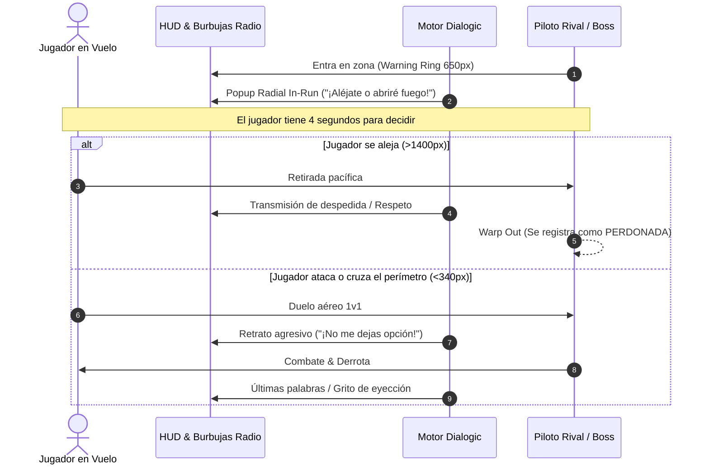
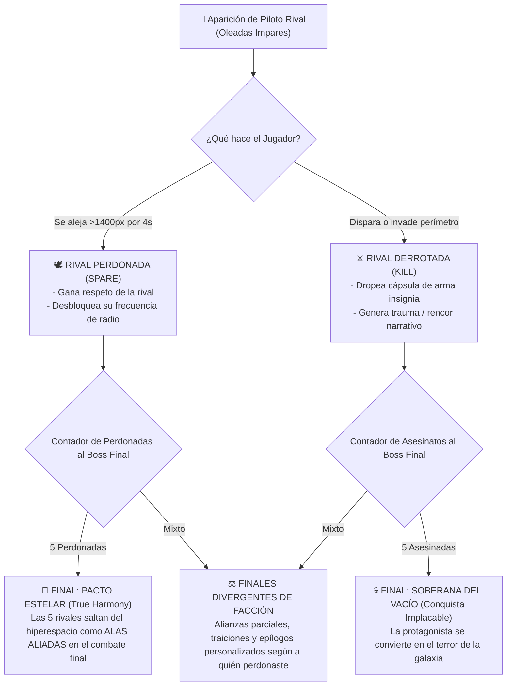
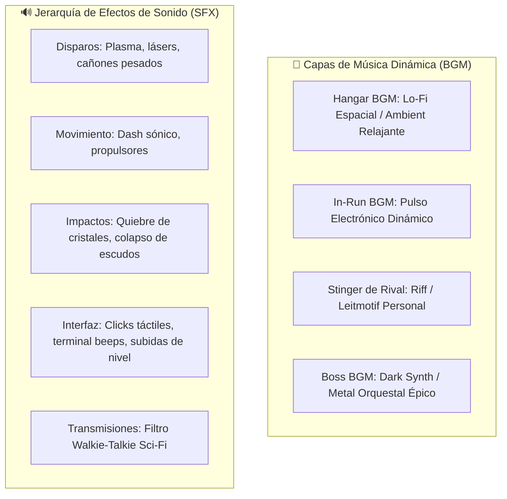

# 🎨 GUÍA MAESTRA CREATIVA: ESTÉTICA, NARRATIVA DIVERGENTE Y UNIVERSO AUDIOVISUAL
> **Destinatario:** Artista Principal, Diseñador Narrativo, Artista de UI/Entornos y Compositor / Diseñador de Audio  
> **Propósito:** Brindar **libertad creativa total** sobre la dirección artística, el estilo visual, los entornos 2.5D, la música y el diseño sonoro, proporcionando el mapa conceptual completo del producto: el gameplay loop, los sistemas de soporte (**Pets**, **Navegadoras**, **Árbol de Talentos**, **Trofeos/Galería**), la **UI**, el **Hub 2.5D**, la integración con **Dialogic** y el sistema de **Pilotos Rivales** con ramificaciones y múltiples finales.

---

## 🧭 1. Manifiesto y Visión: Libertad Creativa con Anclaje Sistémico

> [!IMPORTANT]
> **🚨 AVISO FUNDAMENTAL: TODO EL APARTADO VISUAL, NARRATIVO Y EL TÍTULO SON PLACEHOLDERS**  
> El título actual del proyecto (*"Astra Dream"*), los nombres de las heroínas (*Astra, Ignis, Zephyr, Nyx, etc.*), los nombres de las navegadoras, mascotas, armas, regiones, ítems y habilidades son **100% marcadores de posición (placeholders) provisionales**.  
> Como Artista Principal y Director Creativo posees **autoridad y libertad total para definir el nombre definitivo del juego**, renombrar a las pilotos y mascotas, crear nuevas facciones y sustituir cualquier concepto estético, narrativo o sonoro. Tu única frontera son los sistemas mecánicos del motor (el vuelo 360°, el sistema de satélites, el árbol de talentos, la toma de decisiones de rivales y el motor de diálogo Dialogic).

Este documento unifica y amplía la serie de guías previas ([Lienzo y Anclas](file:///C:/Users/Frani/.gemini/antigravity/scratch/astra_dream/docs/art/guia_lienzo_y_anclas_para_el_artista.md), [Personajes e Ítems](file:///C:/Users/Frani/.gemini/antigravity/scratch/astra_dream/docs/art/guia_personajes_e_items_para_el_artista.md), [Enemigos y Jefes](file:///C:/Users/Frani/.gemini/antigravity/scratch/astra_dream/docs/art/guia_enemigos_y_jefes_para_el_artista.md)). Tu rol no es simplemente "dibujar sprites o componer pistas sueltas", sino **definir el alma, el tono, la identidad sensorial, el nombre y la emoción** de todo este universo.

---

## 🔄 2. Anatomía del Producto: El Gameplay Loop Integral

Para que cada ilustración, shader, acorde musical y efecto de sonido encaje con precisión quirúrgica, este es el flujo de juego que experimenta el jugador:

---

## 🏢 3. El Hangar / Hub 2.5D: El Hogar de las Heroínas

El Hangar no es un simple menú plano; es un **entorno con perspectiva 2.5D (o capas con profundidad de parallax)** donde las heroínas descansan, interactúan y se preparan.

### Oportunidades Visuales y Ambientales para el Hangar
- **Profundidad Parallax (Capas):**
  - *Fondo Lejano:* Grandes ventanales acristalados que muestran nebulosas resplandecientes, naves capitales en tránsito o el planeta madre.
  - *Plano Medio:* Plataformas de anclaje mecha, grúas hidráulicas, cables de recarga de energía y pantallas holográficas flotantes.
  - *Primer Plano:* El suelo metálico del hangar con reflejos tenues, donde caminan o posan los personajes.
- **Vestimentas Informales / "Hub Outfits":** En el Hangar, las pilotos pueden lucir atuendos más relajados, elegantes o sensuales (ropa deportiva táctica, uniformes de descanso, batas de ingeniería) antes de colocarse su armadura pesada en combate.
- **Audio de Ambiente:** Zumbido suave de reactores de fusión, pitidos intermitentes de terminales, pasos metálicos y una música BGM serena de estilo lo-fi espacial o synth-ambient relajante.

---

## 🐾 4. Sistema de Pets (Mascotas de Compañía)

Los **Pets** son pequeños compañeros biomecánicos, drones o criaturas cósmicas que vuelan en órbita alrededor de la heroína durante el vuelo espacial.

### Arquetipos de Mascotas
1. **Pip:** Dron esférico curioso con pantalla LED emocional.
2. **Cosmo:** Felino biomecánico flotante con cola de plasma.
3. **Luna:** Zorro lunar espectral con pelaje de polvo estelar brillante.
4. **Kuro:** Dragón/ciborg en miniatura que escupe chispas al celebrar.
5. **Mochi:** Criatura gelatinosa cósmica y tierna que cambia de color según el estado del combate.

---

## 👩‍✈️ 5. Sistema de Navegadoras: Las Voces del Control Táctico

Las **Navegadoras** permanecen en el puente de mando de la estación, proporcionando inteligencia en tiempo real, soporte moral y auras tácticas.

### Personalidades y Retratos
- **Iris:** La estratega disciplinada y analítica (colores azules/blancos, visor táctico).
- **Zephyr:** La piloto veterana y relajada con actitud burlona (chaqueta de vuelo, colores ámbar/naranja).
- **Caelia:** La inventora excéntrica y entusiasta de la tecnología (gafas de protección, chispas moradas).
- **Vespera:** La misteriosa operadora de la división de operaciones negras (tonos oscuros, sonrisa enigmática).
- **Lyra:** La navegadora alegre e idol espacial (tonos rosa/neón, estética pop futurista).

---

## 🧬 6. Árbol de Talentos y Meta-Progresión (Matriz de Habilidades)

El progreso entre partidas se gestiona en la **Matriz de Núcleos** en el Hangar. El jugador gasta *Polvo Estelar / Fragmentos de Núcleo* ganados en las runs para desbloquear mejoras permanentes.

### Lenguaje Visual y Sonoro para la Matriz de Talentos
- **Estética de Circuito Holográfico:** Los nodos inactivos se ven como hexágonos o constelaciones apagadas; al activarse, se encienden con líneas de energía pulsantes.
- **Nodos Clave (*Keystones*):** Tienen emblemas animados e intrincados que destacan del resto del circuito.
- **Audio Feedback:** Al activar un nodo, debe sonar una descarga de alta tecnología (*High-tech charge hum*) seguido de un clic mecánico pesado de activación.

---

## 🏆 7. Salón de Trofeos, Logros y Holo-Museo

Un espacio de orgullo y colección dentro del Hangar donde el jugador admira sus hazañas:

- **Memorabilia de Rivales:** Cuando una rival es derrotada o perdonada, se desbloquea un artefacto en una vitrina (por ejemplo, el sable de plasma de Nyx, la insignia de honor de una capitana perdonada, o un holo-diario).
- **Cores de Jefes Derrotados:** Núcleos flotantes de los grandes Titanes del juego en pedestales gravitacionales.
- **Galería de Arte y CGs:** Visor de ilustraciones especiales desbloqueadas tras alcanzar distintos finales.
- **Jukebox Espacial:** Reproductor musical para escuchar todas las pistas de la banda sonora desbloqueadas durante las runs.

---

## 🖥️ 8. Interfaz de Usuario (UI / HUD) y Coherencia Estética

La UI debe mantener un equilibrio perfecto entre **claridad en combate frenético** y **sofisticación visual sci-fi**.

### Paleta UI y Micro-Interacciones
- **Colores de Estado:**
  - *Vida:* Verde esmeralda o magenta neón.
  - *Escudo de Energía:* Azul cian eléctrico con efecto de brillo (*Bloom*).
  - *Alerta / Peligro:* Rojo carmesí o naranja ámbar con parpadeo rítmico.
  - *Experiencia / Nivel:* Oro solar o púrpura etéreo.
- **Audio de Interfaz:** Clicks capacitivos sutiles en *hover*, confirmación contundente en *click* y zumbidos suaves al desplegar ventanas holográficas.

---

## 🎭 9. Integración con Dialogic: El Alma de las Interacciones

El proyecto utiliza **Dialogic 2** como motor narrativo. La narrativa no interrumpe bruscamente el frenesí arcade; se integra de tres formas diseñadas para enriquecer la experiencia sin frustrar:

### Canales Narrativos en Dialogic
1. **Burbujas de Radio In-Run (`Radio Transmission Popups`):** Retratos circulares de las navegadoras, rivales o pets que aparecen en los costados de la pantalla sin pausar el juego.
2. **Interludios de Cabina entre Oleadas (`Cockpit Interludes`):** Breve descanso donde la heroína conversa con su navegadora o mascota sobre la misión.
3. **Escenas de Novela Visual en el Hangar / Finales (`Full Visual Novel Dialogues`):** Retratos detallados con expresiones múltiples para escenas clave y epílogos.

---

## ⚔️ 10. Sistema de Pilotos Rivales: El Motor de Ramificación Narrativa

En las oleadas 1, 3, 5, 7 y 9 pueden emerger **Pilotos Rivales** (otras pilotos mecha con sus propias agendas y lealtades). Este sistema es la columna vertebral de la **divergencia de la historia**:

---

## 🎧 11. Arquitectura y Dirección de Audio & Música

---

## 📋 12. Matriz de Entregables para el Equipo Creativo

| Categoría | Entregable Clave | Especificación Sugerida |
| :--- | :--- | :--- |
| **Heroínas (Hub & In-Run)** | 6 Heroínas Base + 1 Desbloqueable (Nyx) | Hub: Retratos full body (1080p+) con expresiones. In-Run: Spritesheets 360°/Direccionales (128x128 o 256x256). |
| **Hangar / Hub 2.5D** | Fondos, plataformas y terminales | Capas de Parallax separadas (Background, Midground, Foreground) a 1920x1080. |
| **Navegadoras & Pets** | 5 Navegadoras + 5 Pets | Navegadoras: Bustos circulares (HUD Radio). Pets: Sprites flotantes de compañía (64x64) con animaciones idle/reacción. |
| **Árbol de Talentos & UI** | Iconografía de nodos, marcos y barras HUD | Iconos vector o pixel art (64x64) + paneles translúcidos modulares. |
| **Salón de Trofeos** | Modelos/Sprites de artefactos y pedestales | Sprites 128x128 con efectos de brillo/holograma. |
| **Pilotos Rivales** | Diseños de Mecha & Retratos de Radio | Retratos normales, hostiles, heridos y de respeto al ser perdonadas. |
| **Ítems & Satélites** | Iconos para las 12 estadísticas y satélites | Iconografía de 64x64 con código de color unificado. |
| **Enemigos & Jefes** | 6 Arquetipos de Enjambre + 3 Titanes | Diseños con puntos débiles luminosos y animaciones de telegrafiado claras. |
| **BGM & Audio Packs** | Pistas de Hub, Biomas, Duelos de Rival y Bosses | Formato OGG en bucle sin costuras (*seamless loop*) + Stems por capas. |
| **SFX Pack** | Disparos, dashes, impactos, cristales, UI beeps | Formato WAV sin pérdida a 44.1kHz / 24-bit. |

---

## 🌟 13. Conclusión: El Universo es Tuyo

El motor está listo, los proyectiles vuelan fluidos a 60 FPS, los satélites orbitan, el hangar espera ser habitado y las pilotos aguardan su voz, su aspecto y su música. Tienes las riendas para plasmar una estética inolvidable que convierta a **Astra Dream** en una joya de culto tanto visual como auditiva y narrativa.
