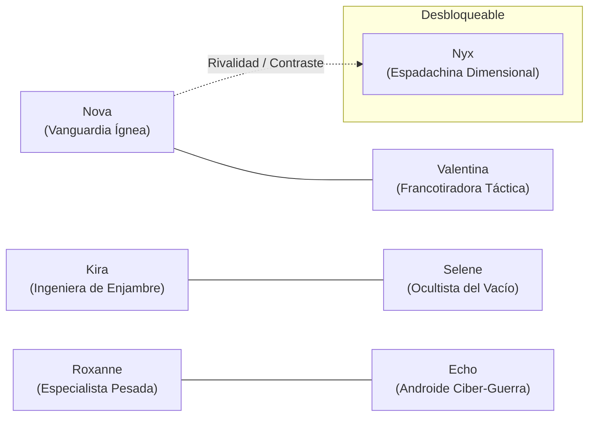

# GUÍA DE DISEÑO DE PERSONAJES, ÍTEMS Y HABILIDADES // ASTRA DREAM
> **Documento de Especificación Creativa, Arquetipos y Metáfora Visual para el Artista**  
> *Versión 1.0 — Área de Arte, Personajes y Diseño de Sistemas*

---

## 1. INTRODUCCIÓN Y VISIÓN DEL PERSONAJE

En *Astra Dream*, los personajes son el corazón palpitante de la experiencia. No son naves genéricas ni vehículos estériles: **son heroínas con carisma, historias entrelazadas, rivalidades y una fuerte presencia estética**.

El juego posee dos escenarios principales donde el jugador las experimenta:
1. **El Hangar / Hub Central (3D):** Donde caminas, interactúas con ellas en sus pedestales, descubres sus personalidades en diálogos in-run y aprecias sus diseños de cuerpo completo en alta resolución.
2. **El Combate Espacial (2D In-Run):** Donde vuelas a hiper-velocidad esquivando balas y desatando tormentas de fuego en 360°.

### 🌟 El Gran Desafío Creativo: De la Pasarela del Hub al Campo de Batalla
Queremos que el diseño de las heroínas se luzca de manera **atractiva, magnética y memorable**:
* **En el Hub:** Hay libertad total para explorar siluetas audaces, expresivas y sensuales.
* **En Combate (In-Run):** La heroína **no va escondida dentro de una cabina opaca**. Vuela directamente en su **Exo-Traje de Combate / Mecha Musume** con propulsores integrados, dejando ver su anatomía, curvas, postura de vuelo y su equipamiento distintivo.

---

## 2. LA FILOSOFÍA DEL "TRAJE DE COMBATE CON PUNTO DÉBIL"

Un concepto central que buscamos plasmar en los trajes de combate es la idea del **traje espacial de alta tecnología con zonas expuestas o puntos débiles deliberados**.

```
    [ EXOSQUELETO TÁCTICO ]          [ ZONAS EXPUESTAS / PUNTO DÉBIL ]
   Armadura de titanio, botas         Mallas de disipación, escotes de flujo,
   propulsoras, hombreras y armas.     abdomen o espalda abierta al reactor.
              \                                      /
               \                                    /
                ===> [ EQUILIBRIO DE DISEÑO ] <====
                    Silueta agresiva, funcional y
                    altamente sensual sin perder
                    su credibilidad de combate.
```

### 💡 Libertad Total de Justificación para el Artista:
Tienes la libertad absoluta de inventar la justificación narrativa que mejor se adapte a tu propuesta visual. Aquí tienes algunas posibles ideas de partida (o puedes crear las tuyas propias):
* **Disipación Térmica Extrema:** Los micro-reactores de fusión de los trajes sobrecalientan tanto que cubrir a la piloto con una coraza 100% cerrada la cocinaría viva. Necesitan rejillas de ventilación directa o mallas térmicas sobre la piel.
* **Sincronización Bio-Neural:** La telemetría cuántica y el sistema de dashes requieren que ciertos receptores nerviosos (en la columna, muslos o clavícula) estén en contacto sin interferencias metálicas.
* **Doctrina de Escudo Cinético Puro:** El traje no confía en placas de acero pesado para frenar balas, sino en un campo de fuerza de sobrecarga. Como la defensa es 100% energética, la piloto prioriza agilidad y ligereza absoluta.

---

## 3. ROSTER PRINCIPAL: LAS 6 HEROÍNAS BÁSICAS + DESBLOQUEABLES

Cada personaje responde a un arquetipo jugable claro (un arma inicial, un tipo de dash único, estadísticas base y una personalidad definida).



---

### 1. NOVA — La Piloto de Vanguardia
* **Rol / Arquetipo:** Asalto frontal a hiper-velocidad, agresión cuerpo a cuerpo y daño de quemarropa.
* **Arma Inicial:** *Cañón de Riel Vanguard Mk.I* (perforación térmica frontal).
* **Mecánica de Dash Única:**
  * **2 Cargas rápidas** (recarga de 1.0s). Dashea exactamente hacia donde apunta la mira.
  * **Rastro Ígneo:** Deja una estela de fuego y plasma que calcina a los enemigos que intentan perseguirla.
  * **Mejora Signature (Omega Spin):** Puede evolucionar a un giro de 360° disparando un haz láser omnidireccional.
* **Personalidad e Interacciones:**
  * Apasionada, audaz, competitiva y adicta a la adrenalina.
  * Considera a Valentina "demasiado calculadora y fría", mientras que ve a Roxanne como su compañera ideal de choque.
* **Pistas de Diseño Visual:**
  * Cabello naranja/rojizo vibrante o coletas dinámicas, visor deportivo de piloto.
  * Exo-traje estilizado con toberas de postcombustión gemelas en caderas o espalda. Tonos cian neón y acentos naranjas de escape de calor.

---

### 2. VALENTINA — La Francotiradora Táctica
* **Rol / Arquetipo:** Precisión quirúrgica, combate a distancia extrema y multiplicadores críticos devastadores.
* **Arma Inicial:** *Rifle de Francotirador Orbital* (haz mono-láser con telemetría de largo alcance).
* **Mecánica de Dash Única:**
  * **1 Carga** (recarga de 1.8s).
  * **Salto de Retroceso Táctico (*Back-Dash*):** Al pulsar el dash, la nave/traje sale propulsada **hacia atrás** (opuesto a donde apunta la mira), permitiendo abrir distancia al instante frente a amenazas.
  * **Estado de Sobre-Enfoque (*Focus State*):** Durante y tras el retroceso, entra en trance de francotirador, aumentando su probabilidad crítica y penetración.
* **Personalidad e Interacciones:**
  * Fría, analítica, elegante y aristocrática. No tolera la improvisación desordenada.
  * Critica los gastos de combustible de Nova y mantiene un respeto mutuo pero distante con Echo.
* **Pistas de Diseño Visual:**
  * Cabello blanco plateado corto o recogido en un moño elegante; monóculo o interfaz ocular holográfica en un solo ojo.
  * Traje ajustado de sigilo balístico en tonos azul marino, blanco y rojo rubí, con líneas alargadas que estilizan su postura de tiro.

---

### 3. KIRA — La Ingeniera de Enjambre
* **Rol / Arquetipo:** Control de masas, saturación de proyectiles automáticos, torretas y nano-drones.
* **Arma Inicial:** *Lanzador Colmena* (dispara salvas de micro-misiles teledirigidos con espoleta de racimo).
* **Mecánica de Dash Única:**
  * **1 Carga** (recarga de 1.4s). Dashea en el vector de movimiento.
  * **Mina Holográfica Señuelo:** En el punto exacto donde inicia el dash, despliega un holograma señuelo que atrae la atención de los enjambres y luego detona en metralla de área.
* **Personalidad e Interacciones:**
  * Curiosa, hiperactiva, gremlin de la tecnología, siempre desarmando chatarra espacial.
  * Habla con sus drones como si fueran mascotas. Suele pedirle piezas prestadas a Roxy y desarmar el software de Echo sin permiso.
* **Pistas de Diseño Visual:**
  * Cabello rubio alborotado, gafas de soldadura/taller en la cabeza, guantes mecánicos y cinturón modular de herramientas.
  * Exo-traje industrial ligero en tonos amarillos de advertencia, negro mate y naranja industrial, con compuertas en hombros o espalda de donde emergen los drones.

---

### 4. SELENE — La Ocultista del Vacío
* **Rol / Arquetipo:** Manipulación gravitatoria, absorción masiva de recursos y control de ritmo temporal.
* **Arma Inicial:** *Pulsar de Singularidad* (orbes de gravedad negativa que colapsan y atraen enemigos).
* **Mecánica de Dash Única:**
  * **Cambio de Fase Astral (*Phase Shift*):** Se vuelve completamente intangible durante el desplazamiento, atravesando balas y enemigos sin colisión física.
  * **Aura de Vacío:** Duplica el radio de recogida de gemas de EXP y ralentiza los proyectiles enemigos que entran en su esfera de influencia.
* **Personalidad e Interacciones:**
  * Mística, susurrante, seductora y enigmática. Habla con las estrellas y los restos del vacío cósmico.
  * Siente una fascinación casi prohibida por los secretos de Iris y Nyx; desconcierta a Valentina porque sus cálculos "desafían la física euclidiana".
* **Pistas de Diseño Visual:**
  * Cabello negro azabache o púrpura profundo que flota como si estuviera sumergido en líquido espacial; velo estelar o tocado arcano.
  * Traje ceñido ceremonial de combate en seda cósmica oscura, detalles dorados arcanos y transparencias místicas en escote y caderas por donde brota energía estelar violeta.

---

### 5. ROXANNE (ROXY) — La Especialista Pesada
* **Rol / Arquetipo:** Tanque implacable, escopeta de metralla de corta distancia y absorción de impacto directo.
* **Arma Inicial:** *Escopeta Titán* (abanico devastador de perdigones cinéticos de alta parada).
* **Mecánica de Dash Única:**
  * **Embestida Cinética Blindada (*Ram Dash*):** Se proyecta violentamente hacia adelante con su escudo frontal activo.
  * **Desintegración de Proyectiles:** Cualquier bala enemiga en su arco frontal durante la embestida **es destruida de inmediato**, y aplasta a los enemigos chocados.
* **Personalidad e Interacciones:**
  * Ruda, leal, protectora, de risa fácil y fuerza bruta monumental. Le gusta resolver los enigmas "de un solo escopetazo".
  * Considera a las demás pilotos como sus hermanas pequeñas y se interpone voluntariamente entre el peligro y ellas.
* **Pistas de Diseño Visual:**
  * Complexión atlética y curvilínea imponente, cabello castaño con mechas rebeldes, hombros anchos y postura desafiante.
  * Traje de exo-armadura pesada con placas reforzadas en antebrazos y espinillas en verde esmeralda y acero blindado, contrastando con zonas elásticas expuestas en cintura y muslos para permitir máxima flexión motora.

---

### 6. ECHO — El Androide de Ciber-Guerra
* **Rol / Arquetipo:** Procs en cadena, arcos eléctricos infinitos y velocidad de ejecución algorítmica.
* **Arma Inicial:** *Arco Tesla Cuántico* (rayos que saltan entre múltiples blancos propagando virus).
* **Mecánica de Dash Única:**
  * **Teletransporte Cuántico / Parpadeo (*Blink Dash*):** No se desliza por el espacio: **desaparece instantáneamente** en un glitch digital y se materializa en la posición de destino, emitiendo una onda de choque estática en ambos puntos.
* **Personalidad e Interacciones:**
  * Inicialmente lógica y carente de emociones humanas, pero experimenta fallos de software cada vez que convive con el humor de Kira o el calor de Nova.
  * Habla con términos de telecomunicaciones y ping de red; fascinada por el concepto biológico de la "intuición".
* **Pistas de Diseño Visual:**
  * Rostro de porcelana cibernética con líneas de circuito que brillan con pulsos de datos; cabello de fibra óptica cian/celeste luminoso.
  * Chasis sintético ultra-estilizado en blanco cerámico y cian luminiscente, con articulaciones mecánicas a la vista y zonas translúcidas que revelan el núcleo cuántico interno.

---

### 7. NYX (DESBLOQUEABLE) — La Espadachina Dimensional
* **Desbloqueo en Campaña:** Se desbloquea tras derrotar a **10 Jefes Titanes** en combate.
* **Rol / Arquetipo:** Melee puro de alta velocidad, esgrima espacial y cortes que anulan proyectiles.
* **Arma Inicial:** *Hoja Crepuscular* (ejecuta tajos en medialuna y cortes giratorios cuerpo a cuerpo).
* **Mecánica de Dash Única:**
  * **Traslación en el Filo:** Se desliza en el espacio dejando una fisura dimensional cortante a su paso. Corta cualquier proyectil en su trayectoria y asesta daño crítico a los enemigos rozados.
* **Personalidad e Interacciones:**
  * Solitaria, implacable, honorable y marcada por una tragedia en los confines del Vacío.
  * Nova quiere medir fuerzas constantemente contra ella; Valentina respeta su letalidad limpia; y Selene reconoce en su hoja la firma del abismo primordial.
* **Pistas de Diseño Visual:**
  * Cabello largo oscuro con reflejos magenta/neón; porte elegante de duelista espacial.
  * Traje ninja/samurái mecha en negro carbón y magenta brillante, con bufanda de plasma etéreo y vaina electromagnética en la cadera.

---

## 4. LA PUERTA ABIERTA: EL CONCEPTO DE "ULTIMATE" (HABILIDAD DEFINITIVA)

En el código actual, cada heroína cuenta con:
`Arma Principal + Pasiva de Clase + Habilidad Activa de Arma + Dash Específico`

Está contemplado en la evolución del diseño incorporar una **Habilidad Definitiva (Ultimate)** que se cargue con daño infligido o gemas recolectadas.

### 🎨 Opciones Creativas para el Artista:
Al diseñar a cada personaje, te invitamos a plantear una de estas dos vertientes para su Ultimate:

| Vertiente de Ultimate | Concepto Visual | Ejemplo por Heroína |
| :--- | :--- | :--- |
| **A) Modo Overdrive / Transformación Visual del Traje** | El exo-traje sobrecarga sus reactores: se abren alas de plasma, se despliegan disipadores gigantes, los ojos brillan en halo y el personaje adquiere una silueta celestial o demoníaca por 10-15s con stats multiplicados. | *Nova:* Se enciende en una valquiria de fuego solar puro.<br>*Selene:* Abre un tercer ojo astral y se vuelve una deidad de agujero negro. |
| **B) Super-Ataque Cinematográfico de Área** | Un ataque de firma único que limpia la pantalla con efectos visuales demoledores y una pose icónica. | *Valentina:* Disparo orbital de satélite coordinado que atraviesa toda la pantalla.<br>*Nyx:* Corte dimensional en pantalla completa que congela el tiempo y raja el espacio. |

---

## 5. EL SISTEMA DE ÍTEMS Y LA METÁFORA VISUAL

En los juegos de supervivencia rogue-lite, **el arte de los ítems es una pieza fundamental del *worldbuilding***:
* En *Risk of Rain*, los ítems son cargamentos y reliquias perdidas de una nave estrellada (jeringas de soldados, ukeleles, patas de cabra).
* En *The Binding of Isaac*, son traumas y objetos bizarros de la infancia de un niño.
* En *Vampire Survivors*, son armas y reliquias de fantasía gótica.

Actualmente en nuestro motor, los ítems existen con nombres y placeholders mecánicos funcionales. **Necesitamos que tú, como artista, propongas la metáfora visual y temática de este universo**:

### 5.1. Los 12 Atributos Clave del Motor
Cada ítem en *Astra Dream* modifica uno de estos parámetros matemáticos:

| Stat Técnico | Función en Combate | Placeholder Actual | Tu Oportunidad de Rediseño Temático |
| :--- | :--- | :--- | :--- |
| `max_health` | Puntos de vida máxima | "Corazón" | *¿Contenedor de nano-reparación? ¿Núcleo de vitalidad orgánica?* |
| `health_regen` | Regeneración continua de HP/seg | "Manzana" | *¿Inyector de plasma regenerativo? ¿Bio-estimulante hormonal?* |
| `move_speed` | Velocidad de aceleración y vuelo | "Botas" | *¿Micro-turbinas de vectorización? ¿Sobrecargador de inercia?* |
| `armor` | Reducción de daño por impacto | "Escudo" | *¿Placa de aleación refractaria? ¿Matriz de campo de dispersión?* |
| `base_damage` | Daño base plano de todas las armas | "Espada" | *¿Amplificador de haz térmico? ¿Condensador cuántico?* |
| `attack_speed` | Cadencia de disparo y activación | "Guante" | *¿Optimizador de ciclo de recarga? ¿Chip de overclock sináptico?* |
| `crit_chance` | Probabilidad de asestar daño crítico | "Gafas" | *¿Lente de telemetría de punto débil? ¿Sensor de micro-fracturas?* |
| `crit_damage` | Multiplicador porcentual del crítico | "Lupa" | *¿Focalizador de plasma hiperbólico? ¿Prisma de haz resonante?* |
| `luck` | Suerte en calidad de cofres y drops | "Trébol" | *¿Procesador de probabilidades cuánticas? ¿Amuleto de piloto estelar?* |
| `pickup_radius` | Radio de atracción magnética de EXP | "Imán" | *¿Emisor de pulso gravitatorio? ¿Vórtice de vacío de succión?* |
| `projectile_count` | Proyectiles adicionales por disparo | "Carcaj" | *¿Divisor de haz multifrecuencia? ¿Cámara de clonación de masa?* |
| `exp_multiplier` | Multiplicador de experiencia obtenida | "Chip Telemetría" | *¿Banco de datos tácticos en tiempo real? ¿Módulo de análisis de batalla?* |

### 5.2. Preguntas para Definir la Taxonomía de Ítems:
* ¿Los ítems son **módulos cibernéticos enchufables** que se acoplan al exo-traje de las heroínas?
* ¿Son **artefactos y reliquias extraterrestres** extraídas de los monolitos y satélites?
* ¿O son **accesorios de moda táctica personal** (amuletos, colgantes, baterías estilizadas, joyería mecha)?

---

## 6. SÍNTESIS Y PRÓXIMOS PASOS

1. **Exploración de Siluetas de Heroínas:** Plantea bocetos de cuerpo entero para el Hub y su versión en vuelo para combate (asegurando que cada una sea reconocible por su postura y distribución de propulsores).
2. **Definición de los Puntos Débiles:** Establece la lógica visual de las zonas expuestas y reactores en los trajes.
3. **Propuesta del Set de Ítems Inicial (12 Íconos):** Dale personalidad visual a la lista de stats para sustituir los placeholders medievales por iconos con identidad propia de *Astra Dream*.

> *¡Tienes las riendas creativas para hacer que estas pilotos e ítems sean inolvidables!*
