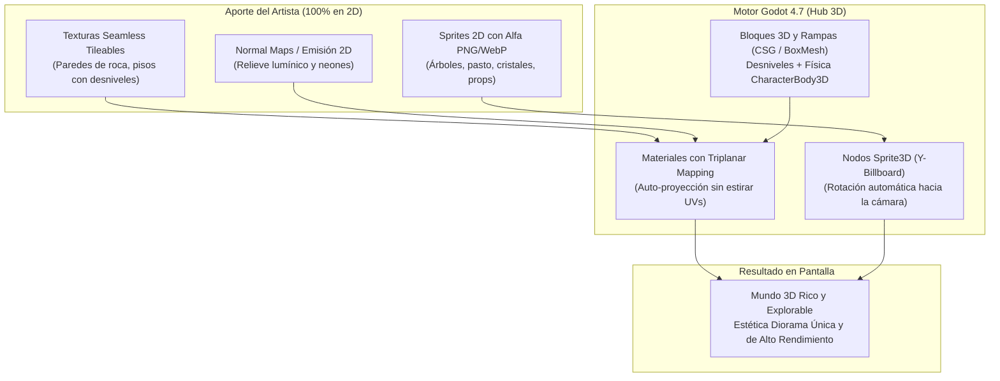

# Guía Técnica de Arte: Creación de Entornos Híbridos 2.5D (Diorama 3D con Arte 2D)

> **Destinatario:** Artista 2D del equipo de Astra Dream  
> **Motor:** Godot Engine 4.7 (Mobile Renderer / Vulkan Forward Mobile)  
> **Enfoque:** Mapas 3D con desniveles, paredes volumétricas y props/vegetación 2D sin necesidad de software ni conocimientos de modelado 3D.

---

## 1. Veredicto Inicial: La Idea es 100% Viable y Excelente

La intuición del artista es **completamente acertada**. Esta técnica se conoce en la industria como **Entorno Híbrido 2.5D / Diorama Estilo Billboard** (popularizada por referentes como *Ragnarok Online*, *Octopath Traveler*, *Paper Mario*, *Don't Starve*, *Cult of the Lamb* y los clásicos de 32-bits de PlayStation 1).

En nuestro motor, **el artista no necesita tocar Blender ni ningún software de modelado 3D**. El motor permite:
1. **Que el programador arme la geometría del nivel** en minutos dentro de Godot mediante primitivas sólidas, rampas, desniveles y bloques CSG (`CSGBox3D`, `CSGPolygon3D`).
2. **Que el artista suministre exclusivamente imágenes 2D:**
   - Texturas repetibles (muros de piedra, suelos rocosos, arena, metal, adoquines).
   - Sprites recortados con fondo transparente (árboles, flores, pasto, farolas, postes, escombros, personajes).
   - Mapas de normales 2D opcionales para que las texturas planas reaccionen con relieve a las luces 3D.
3. **Que Godot ensamble y proyecte todo automáticamente**, resolviendo la perspectiva, las sombras y la profundidad.

---

## 2. Cómo Funciona Cada Componente en Godot 4.7



---

### A. Paredes y Suelos con Desniveles (Geometría Sólida sin Modelar)

Para que haya desniveles (rampas, escalones, colinas, muros) con colisión física real:
- **En el motor:** Usamos geometrías paramétricas nativas (`CSGCombiner3D` y mallas primitivas). Podemos crear una rampa inclinada de 30° o un muro de piedra en segundos solo arrastrando medidas en el inspector de Godot.
- **La herramienta secreta para el artista: *Triplanar Mapping*:**
  - Cuando se modela en 3D tradicional, hay que hacer "UV Unwrapping" (abrir el modelo en plano), lo cual es tedioso y requiere aprender 3D.
  - Con **Triplanar Mapping** activado en el `StandardMaterial3D` de Godot, el motor proyecta la textura 2D desde los tres ejes del espacio (X, Y, Z).
  - **Consecuencia:** Puedes dibujar una textura de piedra de `1024x1024` o `512x512` píxeles, y la textura se repetirá automáticamente sobre paredes verticales, pisos inclinados y desniveles **sin deformarse, sin estirarse y sin costuras feas**, adaptándose sola a cualquier forma.

---

### B. Árboles, Pasto y Vegetación (`Sprite3D` y Billboarding)

Para los elementos del escenario que no son paredes o suelos:
1. **Y-Billboard (`BaseMaterial3D.BILLBOARD_FIXED_Y`):**
   - El árbol o poste se dibuja en un plano 2D vertical dentro del espacio 3D.
   - El nodo rota automáticamente alrededor de su eje vertical (Y) para mirar siempre a la cámara del jugador.
   - Da la sensación de volumen perfecto mientras se camina a su alrededor (la misma técnica que ya usamos con las pilotos en el Hub actual).
2. **Cruceta 3D (Cross-Billboard / Malla en X):**
   - Para arbustos densos, plantas o hierba alta donde no se quiere que rote, se usan dos planos 2D cruzados en ángulo de 90° formando una "X" vistos desde arriba.
   - El jugador puede rodear el arbusto y siempre verá densidad y follaje desde cualquier ángulo.
3. **Pasto denso por capas:**
   - Franjas horizontales de pasto recortado (`512x128` px) colocadas escalonadamente a lo largo de las pendientes del suelo, generando capas de profundidad.

---

## 3. Limitaciones Técnicas del Motor (Godot 4.7 Mobile Renderer)

Nuestro proyecto está optimizado con el perfil **Mobile (Vulkan Forward Mobile)** para garantizar **60+ FPS estables** tanto en PC como en hardware modesto. Esto define ciertas pautas técnicas clave que el artista debe conocer:

### 1. Manejo de Transparencia y Rendimiento (*Alpha Cut*)
> [!IMPORTANT]
> **Regla de Oro:** Usar `Alpha Scissor` (`ALPHA_CUT_DISCARD`) en lugar de `Alpha Blend` para la vegetación y props.

- **Por qué:** Las GPUs móviles y los renderizadores eficientes sufren cuando hay muchas capas de transparencia suave una detrás de otra (*Alpha Blending*), provocando que algunos sprites se dibujen incorrectamente por delante o por detrás (problemas de orden en el Z-buffer) y consumiendo mucho rendimiento.
- **Cómo preparar las imágenes:**
  - El borde de los árboles, ramas y hojas debe ser **nítido** (píxeles 100% opacos o 100% transparentes, o con un margen de degradado mínimo).
  - En Godot configuramos el material en `Alpha Cut: Discard` con un umbral de recorte (threshold ~`0.5`). Esto permite que los sprites 2D escriban en el buffer de profundidad 3D y proyecten sombras reales sobre el suelo.

### 2. Dimensiones y Potencias de Dos (POT)
- **Formatos:** `.png` con canal alfa (RGB + Alpha) o `.webp` sin pérdida.
- **Tamaños recomendados (Potencias de 2):**
  - **Suelos y paredes repetibles:** `512x512` px o `1024x1024` px (evitar subir a `4096` salvo que sea un mural gigante).
  - **Árboles y estructuras grandes:** `1024x1024` px o `512x1024` px.
  - **Pasto, flores, props pequeños (farolas, cajas, rocas sueltas):** `256x256` px o `512x512` px.
  - *Ventaja:* Las texturas de potencias de 2 permiten generar **Mipmaps** limpios, evitando que los objetos lejanos parpadeen o tengan aliasing ruidoso.

### 3. Luces y Sombras en Mobile
- **Luz principal:** Contamos con una `DirectionalLight3D` (el "sol" o luz ambiental espacial) que genera sombras proyectadas en tiempo real.
- **Luces puntuales:** Podemos colocar `OmniLight3D` (antorchas, farolas de neón, lámparas bioluminiscentes). En el renderer Mobile se recomienda no solapar más de **4 a 6 luces por sector** para evitar caídas de fotogramas.
- **Emisión (Auto-iluminación):** El artista puede entregar un mapa de **Emisión** en blanco y negro (o color) para que las runas, hongos mágicos o luces de máquinas brillen con el efecto *Glow/Bloom* sin consumir cálculo de sombras.

### 4. Iluminación y Relieve con Normal Maps 2D
> [!TIP]
> Los sprites 2D no tienen por qué verse planos ante la luz 3D.

- Si el artista genera un **Normal Map** para la textura de piedra o el tronco del árbol (utilizando herramientas como *Laigter*, *SpriteIlluminator* o plugins de Photoshop/Krita):
- Las antorchas o el sol 3D iluminarán los relieves, grietas y bordes de la textura 2D como si fuera un modelo tridimensional esculpido.

---

## 4. Guía Práctica de Entrega para el Artista

Para empezar a experimentar de inmediato, el artista solo necesita preparar este lote básico de prueba:

| Tipo de Asset | Ejemplo | Formato y Tamaño | Requisitos de Arte |
| :--- | :--- | :---: | :--- |
| **Textura de Suelo** | Tierra rocosa, césped, placas metálicas | `1024x1024` PNG | **Seamless / Tileable** (que los bordes izquierdo/derecho y superior/inferior coincidan al repetirse). |
| **Textura de Muro** | Muro de piedra, roca escarpada, pared de hangar | `1024x1024` PNG | **Seamless** horizontal y verticalmente. |
| **Prop Vegetación Alta** | Árbol espacial, hongo gigante, cristal alienígena | `512x1024` PNG | Fondo transparente. **Pivote:** Dejar la base/raíces justo en el borde inferior central de la imagen. |
| **Prop de Suelo/Pasto** | Mata de hierba, matojo de flores, rocas sueltas | `256x256` PNG | Fondo transparente con recorte limpio. Base apoyada abajo. |
| **Textura de Emisión (Opcional)** | Luces, vetas de cristal brillante, runas | Mismo tamaño PNG | Zonas brillantes en color puro; zonas apagadas en negro total (`#000000`). |

---

## 5. El Rol del Programador vs. El Rol del Artista

```
┌──────────────────────────────────────────────┐
│                  ARTISTA 2D                  │
│  - Dibuja texturas repetibles (Piedra/Piso) │
│  - Ilustra sprites de follaje y props        │
│  - Define la paleta de color y la atmósfera  │
│  - (Opcional) Genera mapas de emisión/normal │
└──────────────────────┬───────────────────────┘
                       │ Entrega archivos PNG
                       ▼
┌──────────────────────────────────────────────┐
│                 PROGRAMADOR                  │
│  - Construye la geometría 3D (Rampas/Muros)  │
│  - Aplica StandardMaterial3D + Triplanar     │
│  - Instancia los Sprite3D en el mapa         │
│  - Ajusta colisiones, cámara y luces         │
└──────────────────────────────────────────────┘
```

---

## 6. Conclusión y Recomendación

**Adelante con la idea.** Es una solución sumamente estética, liviana para el motor, rápida de iterar y que aprovecha el 100% del talento del artista 2D sin obligarlo a aprender curvas de aprendizaje complejas de modelado poligonal ni topología 3D. 

El resultado visual combina la calidez y expresividad del dibujo 2D artesanal con la inmersión, desniveles y exploración espacial de un mundo tridimensional.
