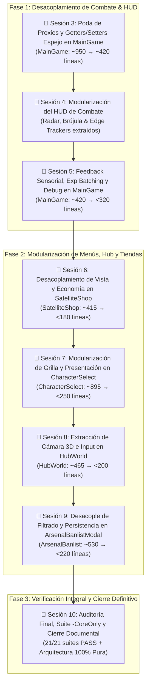

# Plan Maestro Integral de Desacoplamiento y Modularización 100% — Astra Dream

> **Objetivo Global:** Culminar la transición arquitectónica de Astra Dream erradicando la totalidad de monolitos y God Objects restantes en el proyecto (`MainGame`, `GameHUD`, `CharacterSelectUI`, `SatelliteShop`, `HubWorld` y `ArsenalBanlistModal`).
> Ningún archivo en el proyecto superará las 300–400 líneas. El 100% de los componentes cumplirán el principio de responsabilidad única (SRP), con tipado estricto GDScript 4 y verificación automatizada continua mediante el arnés anti-cuelgues (`tools/run_tests.ps1`).

---

## 🗺️ Estructura Completa de Sesiones Atómicas (1 Tarea = 1 Conversación)

---

## 📌 Sesión 3: Poda de Proxies y Limpieza Espejo en `MainGame`
* **Objetivo:** Eliminar ~320 líneas de funciones puente de una sola línea y propiedades espejo redundantes en [`scenes/combat/main_game.gd`](file:///c:/Users/Frani/.gemini/antigravity/scratch/astra_dream/scenes/combat/main_game.gd).
* **Archivos Afectados:**
  - `scenes/combat/main_game.gd`
  - `scenes/combat/directors/boss_cinematic_sequence.gd` (invocar directamente `main_game.narrative_director`)
  - `scenes/combat/navigators/navigator_controller.gd` (invocar directamente `main_game.satellite_coordinator`)
* **Alcance Técnico:**
  1. **Poda de Wrappers Narrativos (L507–L536):**
     - Desviar llamadas de alerta y diálogos hacia `narrative_director` o `EventBus`.
     - Mantener firmas delegadas compactas solo en casos indispensables para compatibilidad con suites de test.
  2. **Poda de Wrappers Satelitales (L589–L600):**
     - `_check_satellite_despawn()`, `_despawn_current_satellite()`, `_spawn_next_satellite_for_wave()` transferidos a `satellite_coordinator` o consumidos por `wave_pipeline`.
  3. **Poda de Wrappers de Bosses y Encuentros (L658–L693):**
     - `_spawn_elite_herald()`, `_spawn_rival_pilot()`, `_spawn_wave_boss()`, etc., delegados exclusivamente en `boss_coordinator`.
  4. **Compactación de Propiedades Espejo:**
     - Getters/setters delegados transparentes (`run_time_elapsed`, `current_wave`, `wave_timer`) leyendo directamente de `telemetry_coordinator` y `wave_pipeline`.
* **Micro-Tests de Verificación (Latencia 2-5s):**
  - `powershell -ExecutionPolicy Bypass -File tools/run_tests.ps1 -Test "test_boss_runner.tscn"`
  - `powershell -ExecutionPolicy Bypass -File tools/run_tests.ps1 -Test "test_dialogue_skip_runner.tscn"`
  - `powershell -ExecutionPolicy Bypass -File tools/run_tests.ps1 -Test "test_gamespeed_and_satellite_despawn_runner.tscn"`

---

## 📌 Sesión 4: Modularización del HUD de Combate (Radar y Edge Trackers)
* **Objetivo:** Extraer la matemática de proyección espacial, radares y seguimiento perimetral de [`scenes/ui/hud/hud.gd`](file:///c:/Users/Frani/.gemini/antigravity/scratch/astra_dream/scenes/ui/hud/hud.gd) (~220 líneas menos).
* **Archivos Afectados:**
  - `scenes/ui/hud/components/hud_satellite_radar_controller.gd` (Nuevo componente `RefCounted`, tipado estricto).
  - `scenes/ui/hud/components/hud_edge_tracker_manager.gd` (Nuevo componente `RefCounted` unificando indicadores perimetrales).
  - `scenes/ui/hud/hud.gd` (Refactorizado para delegar en los nuevos componentes).
* **Alcance Técnico:**
  1. **Creación de `HUDSatelliteRadarController`:**
     - Encapsular la lógica de cálculo de distancia euclidiana, cálculo de flechas de texto (`↑`, `↓`, `←`, `→`), formato de etiquetas de búsqueda de satélites y vinculación con `SatelliteEdgeIndicator`.
  2. **Creación de `HUDEdgeTrackerManager`:**
     - Orquestar polimórficamente los rastreadores en pantalla de satélites, arcanas, cofres y jefes (`satellite_tracker`, `arcana_tracker`, `boss_tracker`, `chest_tracker`).
  3. **Poda de `_process(delta)` en `hud.gd`:**
     - Trasladar las actualizaciones continuas de coordenadas del radar y retícula de fijación fuera del script central del HUD.
* **Micro-Tests de Verificación (Latencia 2-5s):**
  - `powershell -ExecutionPolicy Bypass -File tools/run_tests.ps1 -Test "test_hud_suite.tscn"`
  - `powershell -ExecutionPolicy Bypass -File tools/run_tests.ps1 -Test "test_weapon_swap_and_hud_runner.tscn"`

---

## 📌 Sesión 5: Feedback Sensorial, Exp Batching y Debug en `MainGame`
* **Objetivo:** Desacoplar las reacciones sensoriales (camera shake / trauma, auto-guardado, optimización de gemas y modal de debug) fuera de [`main_game.gd`](file:///c:/Users/Frani/.gemini/antigravity/scratch/astra_dream/scenes/combat/main_game.gd) para llevarlo a su tamaño definitivo (<320 líneas).
* **Archivos Afectados:**
  - `scenes/combat/systems/combat_player_feedback_coordinator.gd` (Nuevo componente `RefCounted` o `Node`).
  - `scenes/combat/systems/combat_exp_batch_optimizer.gd` (Nuevo optimizador de gemas).
  - `scenes/combat/main_game.gd` (Poda final de bucles y conexiones directas).
* **Alcance Técnico:**
  1. **Creación de `CombatPlayerFeedbackCoordinator`:**
     - Conectar `player.health_changed` y `player.bomb_used` para inyectar trauma y shake en `camera`.
     - Manejar el enrutamiento de muerte del jugador hacia `end_run_controller`.
  2. **Creación de `CombatExpBatchOptimizer`:**
     - Mover el temporizador y llamada periódica `ExpBlob.batch_distant_blobs_if_needed(get_tree(), player.global_position)`.
  3. **Desacoplar Ingame Debug Modal:**
     - Transferir la invocación y toggle de `IngameDebugModal` al `CombatInputDispatcher`.
* **Micro-Tests de Verificación (Latencia 2-5s):**
  - `powershell -ExecutionPolicy Bypass -File tools/run_tests.ps1 -Test "test_combat_flow_runner.tscn"`
  - `powershell -ExecutionPolicy Bypass -File tools/run_tests.ps1 -Test "test_player_exo_ships_runner.tscn"`

---

## 📌 Sesión 6: Desacoplamiento de Vista y Economía en `SatelliteShop`
* **Objetivo:** Separar la lógica económica y reglas de precios de la vista gráfica en [`scenes/combat/satellite/satellite_shop.gd`](file:///c:/Users/Frani/.gemini/antigravity/scratch/astra_dream/scenes/combat/satellite/satellite_shop.gd) (reducción de ~415 a <180 líneas).
* **Archivos Afectados:**
  - `scenes/combat/satellite/components/satellite_shop_economy_controller.gd` (Nuevo controlador económico).
  - `scenes/combat/satellite/satellite_shop.gd` (Refactorizado como CanvasLayer puramente presentacional).
* **Alcance Técnico:**
  1. **Creación de `SatelliteShopEconomyController`:**
     - Extraer el cálculo de precios, soporte de compras gratis de depuración (`is_free_shopping_enabled`), validación de créditos suficientes y deducción monetaria.
  2. **Conversión de `SatelliteShop` a Vista Pasiva:**
     - La tienda solo renderiza las tarjetas de ítems/armas y propaga eventos de compra y cierre.
* **Micro-Tests de Verificación (Latencia 2-5s):**
  - `powershell -ExecutionPolicy Bypass -File tools/run_tests.ps1 -Test "test_satellite_items_runner.tscn"`
  - `powershell -ExecutionPolicy Bypass -File tools/run_tests.ps1 -Test "test_run_stats_and_shop_inventory_runner.tscn"`

---

## 📌 Sesión 7: Modularización de Grilla y Presentación en `CharacterSelectUI`
* **Objetivo:** Extraer la instanciación procedural del elenco de heroínas y la coordinación de tweens visuales fuera de [`scenes/ui/character_select/character_select.gd`](file:///c:/Users/Frani/.gemini/antigravity/scratch/astra_dream/scenes/ui/character_select/character_select.gd) (reducción de ~895 a <250 líneas).
* **Archivos Afectados:**
  - `scenes/ui/character_select/components/character_roster_grid_builder.gd` (Nuevo builder).
  - `scenes/ui/character_select/components/character_select_display_manager.gd` (Consolidación de tweens).
  - `scenes/ui/character_select/character_select.gd` (Fachada orquestadora pura).
* **Alcance Técnico:**
  1. **Creación de `CharacterRosterGridBuilder`:**
     - Encapsular la construcción dinámica de los botones del elenco, iconos de clase e inyección de estados bloqueados/desbloqueados (`_populate_roster`).
  2. **Migración de Tweens a `CharacterSelectDisplayManager`:**
     - Mover los efectos de entrada, fade de siluetas vectoriales y backlight glows fuera de `character_select.gd`.
* **Micro-Tests de Verificación (Latencia 2-5s):**
  - `powershell -ExecutionPolicy Bypass -File tools/run_tests.ps1 -Test "test_player_exo_ships_runner.tscn"`
  - `powershell -ExecutionPolicy Bypass -File tools/run_tests.ps1 -Test "test_phase1_ui_polish_runner.tscn"`

---

## 📌 Sesión 8: Extracción de Cámara 3D e Input en `HubWorld`
* **Objetivo:** Desacoplar el seguimiento orbital de la cámara 3D y la intercepción de teclas globales fuera de [`scenes/ui/hub/hub_world.gd`](file:///c:/Users/Frani/.gemini/antigravity/scratch/astra_dream/scenes/ui/hub/hub_world.gd) (reducción de ~465 a <200 líneas).
* **Archivos Afectados:**
  - `scenes/ui/hub/components/hub_camera_controller_3d.gd` (Nuevo controlador cinemático 3D).
  - `scenes/ui/hub/components/hub_input_dispatcher.gd` (Nuevo despachador de teclas del Hub).
  - `scenes/ui/hub/hub_world.gd` (Fachada orquestadora ligera del hangar).
* **Alcance Técnico:**
  1. **Creación de `HubCameraController3D`:**
     - Encapsular interpolaciones de cámara en 3ª persona, transiciones hacia terminales e inspección orbital de naves.
  2. **Creación de `HubInputDispatcher`:**
     - Mover el manejo de atajos de teclado (ESC, pausa, menús de opciones y debug) fuera de `hub_world.gd`.
* **Micro-Tests de Verificación (Latencia 2-5s):**
  - `powershell -ExecutionPolicy Bypass -File tools/run_tests.ps1 -Test "test_phase2_tactical_focus_runner.tscn"`

---

## 📌 Sesión 9: Desacople de Filtrado y Persistencia en `ArsenalBanlistModal`
* **Objetivo:** Separar las reglas de filtrado de ítems y la escritura en disco de la presentación gráfica en [`scenes/ui/character_select/arsenal_banlist_modal.gd`](file:///c:/Users/Frani/.gemini/antigravity/scratch/astra_dream/scenes/ui/character_select/arsenal_banlist_modal.gd) (reducción de ~530 a <220 líneas).
* **Archivos Afectados:**
  - `scenes/ui/character_select/components/banlist_filter_service.gd` (Nuevo servicio de datos y filtrado).
  - `scenes/ui/character_select/arsenal_banlist_modal.gd` (Vista puramente presentacional).
* **Alcance Técnico:**
  1. **Creación de `BanlistFilterService`:**
     - Encapsular la consulta al catálogo de ítems, verificación de desbloqueos en perfil y persistencia de vetos en `SaveManager`.
  2. **Conversión del Modal a Vista Pasiva:**
     - El modal únicamente dibuja la grilla visual de cartas y propaga eventos de toggle.
* **Micro-Tests de Verificación (Latencia 2-5s):**
  - `powershell -ExecutionPolicy Bypass -File tools/run_tests.ps1 -Test "test_arsenal_banlist_modal_runner.tscn"`

---

## 📌 Sesión 10: Auditoría Final, Suite `-CoreOnly` y Cierre Definitivo
* **Objetivo:** Verificar la integridad de los 21 subsistemas nodales, auditar métricas de líneas y sellar la documentación técnica sin ninguna regresión.
* **Archivos Afectados:**
  - `AGENT_CONTEXT.md`
  - `docs/DOMAIN_MAP.md`
  - `ARCHITECTURE.md`
* **Alcance Técnico:**
  1. **Auditoría de Volumetría:**
     - Confirmar que ningún archivo en `scenes/` o `core/` supere las 300–400 líneas (excepto `bullet_server.gd` justificado por arrays Cero-Alloc).
  2. **Ejecución de Suite Integral:**
     - `powershell -ExecutionPolicy Bypass -File tools/run_tests.ps1 -CoreOnly` (21/21 suites PASS, 0 cuelgues, 0 fallos).
  3. **Actualización Final de Documentación:**
     - Sincronizar todos los diagramas y tablas de referencia rápida con los nuevos componentes.
* **Verificación Final:**
  - `powershell -ExecutionPolicy Bypass -File tools/run_tests.ps1 -CoreOnly`

---

## 🛡️ Protocolo Operativo Estricto por Sesión

1. **Principio 1 Tarea = 1 Sesión:** Al finalizar cada sesión (por ejemplo, Sesión 3), realizar el commit correspondiente y abrir una nueva sesión atómica para mantener el contexto limpio (<80k tokens).
2. **Uso Exclusivo de Micro-Tests:** Durante el desarrollo activo, correr únicamente la suite de prueba vinculada a la sesión (latencia ~2s). Reservar `-CoreOnly` para la Sesión 10.
3. **Tipado Estricto Obligatorio:** Cero variables sin tipo explícito (`var x: float = 0.0`, `func f() -> void:`).
4. **Cuestionarios Interactivos (`ask_question`):** Toda confirmación de commit o decisión de diseño debe consultarse interactivamente.
