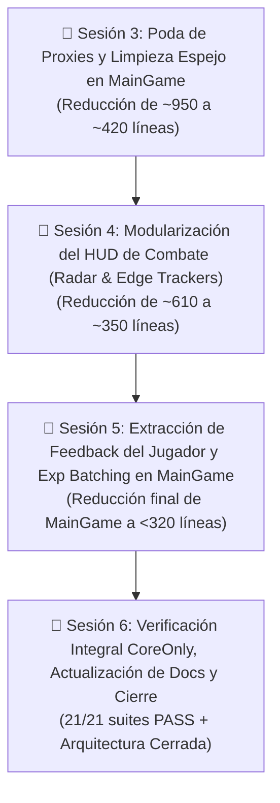

# Plan Maestro de Desacoplamiento y Modularización Integral — Astra Dream

> **Objetivo Global:** Culminar la transformación arquitectónica de `MainGame` (`scenes/combat/main_game.gd`) y `GameHUD` (`scenes/ui/hud/hud.gd`), erradicando funciones proxy, gestores embebidos y responsabilidades cruzadas, reduciendo ambos componentes a fachadas orquestadoras esbeltas (<350-400 líneas) con responsabilidad única, estricto tipado estático GDScript 4 y 100% de compatibilidad con las suites de prueba existentes.

---

## 🗺️ Mapa de Ruta por Sesiones Atómicas (Regla: 1 Tarea = 1 Sesión)

---

## 📌 Sesión 3: Poda de Proxies y Limpieza de Getters/Setters Espejo en `MainGame`

* **Objetivo:** Eliminar ~320 líneas de funciones pasarela de una sola línea y propiedades puente obsoletas en [`main_game.gd`](file:///c:/Users/Frani/.gemini/antigravity/scratch/astra_dream/scenes/combat/main_game.gd).
* **Archivos Afectados:**
  - `scenes/combat/main_game.gd`
  - `scenes/combat/directors/boss_cinematic_sequence.gd` (apuntar llamadas de alertas y diálogos directamente a `narrative_director`)
  - `scenes/combat/navigators/navigator_controller.gd` (apuntar spawn de satélites directamente a `satellite_coordinator`)
* **Alcance Técnico:**
  1. **Poda de Wrappers Narrativos (L507–L536):**
     - Redirigir invocadores externos de `_trigger_pet_rival_jump_warning`, `_trigger_rival_face_to_face_dialogue`, `_trigger_climax_dialogue`, `_trigger_pet_boss_alert` para que consuman `main_game.narrative_director` o emitan vía señal.
     - Conservar firmas esenciales como facades delegadas puras en `main_game.gd` solo donde tests legacy requieran duck-typing (`has_method`).
  2. **Poda de Wrappers Satelitales (L589–L600):**
     - `_check_satellite_despawn()`, `_despawn_current_satellite()`, `_spawn_next_satellite_for_wave()` delegados directamente en `satellite_coordinator` o consumidos por `wave_pipeline`.
  3. **Poda de Wrappers de Bosses y Encuentros (L658–L693):**
     - `_spawn_elite_herald()`, `_spawn_rival_pilot()`, `_spawn_wave_boss()`, etc., delegados exclusivamente en `boss_coordinator`.
  4. **Limpieza de Getters/Setters Espejo:**
     - Mantener acceso seguro a variables requeridas por tests (`run_time_elapsed`, `current_wave`, `wave_timer`) mediante propiedades compactas y transparentes con lectura directa de `telemetry_coordinator` y `wave_pipeline`.
* **Micro-Tests de Verificación (Latencia 2-5s):**
  - `powershell -ExecutionPolicy Bypass -File tools/run_tests.ps1 -Test "test_boss_runner.tscn"`
  - `powershell -ExecutionPolicy Bypass -File tools/run_tests.ps1 -Test "test_dialogue_skip_runner.tscn"`
  - `powershell -ExecutionPolicy Bypass -File tools/run_tests.ps1 -Test "test_gamespeed_and_satellite_despawn_runner.tscn"`

---

## 📌 Sesión 4: Modularización del HUD de Combate (Radar y Edge Trackers)

* **Objetivo:** Extraer la matemática de proyección espacial, radares y seguimiento perimetral de [`scenes/ui/hud/hud.gd`](file:///c:/Users/Frani/.gemini/antigravity/scratch/astra_dream/scenes/ui/hud/hud.gd) (~220 líneas menos).
* **Archivos Afectados:**
  - `scenes/ui/hud/components/hud_satellite_radar_controller.gd` (Nuevo componente `RefCounted`, tipado estricto).
  - `scenes/ui/hud/components/hud_edge_tracker_manager.gd` (Nuevo componente `RefCounted` unificando indicadores perimetrales).
  - `scenes/ui/hud/hud.gd` (Refactorizado para delegar en los nuevos componentes).
* **Alcance Técnico:**
  1. **Creación de `HUDSatelliteRadarController`:**
     - Encapsular la lógica de cálculo de distancia euclidiana, cálculo de flechas de texto (`↑`, `↓`, `←`, `→`), formato de etiquetas de búsqueda de satélites y vinculación con `SatelliteEdgeIndicator`.
  2. **Creación de `HUDEdgeTrackerManager`:**
     - Orquestar polimórficamente los rastreadores en pantalla de satélites, arcanas, cofres y jefes (`satellite_tracker`, `arcana_tracker`, `boss_tracker`, `chest_tracker`).
  3. **Poda de `_process(delta)` en `hud.gd`:**
     - Trasladar las actualizaciones continuas de coordenadas del radar y retícula de fijación fuera del script central del HUD.
* **Micro-Tests de Verificación (Latencia 2-5s):**
  - `powershell -ExecutionPolicy Bypass -File tools/run_tests.ps1 -Test "test_hud_suite.tscn"`
  - `powershell -ExecutionPolicy Bypass -File tools/run_tests.ps1 -Test "test_weapon_swap_and_hud_runner.tscn"`

---

## 📌 Sesión 5: Extracción de Feedback del Jugador y Exp Batching en `MainGame`

* **Objetivo:** Desacoplar las reacciones sensoriales (camera shake / trauma, auto-guardado y optimización de cristales) fuera de [`main_game.gd`](file:///c:/Users/Frani/.gemini/antigravity/scratch/astra_dream/scenes/combat/main_game.gd).
* **Archivos Afectados:**
  - `scenes/combat/systems/combat_player_feedback_coordinator.gd` (Nuevo controlador `Node` o `RefCounted`).
  - `scenes/combat/systems/combat_exp_batch_optimizer.gd` (Nuevo componente para compactación de EXP).
  - `scenes/combat/main_game.gd` (Poda de lógica reactiva de daño/bombas y timer de optimización).
* **Alcance Técnico:**
  1. **Creación de `CombatPlayerFeedbackCoordinator`:**
     - Conectar `player.health_changed` y `player.bomb_used` para inyectar trauma y shake en `camera`.
     - Manejar el enrutamiento de muerte del jugador hacia `end_run_controller`.
  2. **Creación de `CombatExpBatchOptimizer`:**
     - Mover el temporizador y llamada periódica `ExpBlob.batch_distant_blobs_if_needed(get_tree(), player.global_position)`.
  3. **Desacoplar Ingame Debug Modal:**
     - Mover la instanciación de `IngameDebugModal` al `CombatInputDispatcher`.
* **Micro-Tests de Verificación (Latencia 2-5s):**
  - `powershell -ExecutionPolicy Bypass -File tools/run_tests.ps1 -Test "test_combat_flow_runner.tscn"`
  - `powershell -ExecutionPolicy Bypass -File tools/run_tests.ps1 -Test "test_player_exo_ships_runner.tscn"`

---

## 📌 Sesión 6: Verificación Integral CoreOnly, Actualización Documental y Cierre

* **Objetivo:** Ejecutar la suite integral de 21 tests sin fallos ni cuelgues, actualizar la documentación técnica y sellar la refactorización arquitectónica.
* **Archivos Afectados:**
  - `AGENT_CONTEXT.md`
  - `docs/DOMAIN_MAP.md`
  - `ARCHITECTURE.md`
* **Alcance Técnico:**
  1. **Verificación Integral:**
     - Ejecutar `powershell -ExecutionPolicy Bypass -File tools/run_tests.ps1 -CoreOnly` (21 suites, 0 cuelgues, 0 fallos).
  2. **Actualización de Documentación:**
     - Reflejar las nuevas clases en las tablas de arquitectura y en el mapa de dominios.
  3. **Auditoría de Métricas Finales:**
     - Medir líneas de código resultantes (`main_game.gd` < 350 líneas, `hud.gd` < 350 líneas).
* **Verificación Final:**
  - `powershell -ExecutionPolicy Bypass -File tools/run_tests.ps1 -CoreOnly`

---

## 🛡️ Reglas de Operación Estricta

1. **Anti-Cuelgues:** Usar exclusivamente `tools/run_tests.ps1 -Test "<suite>"` para las iteraciones intermedias (latencia de 2 segundos). Reservar `-CoreOnly` solo para la Sesión 6.
2. **Ediciones Quirúrgicas:** No reescribir archivos masivos; usar `replace_file_content` para parches diferenciales limpios.
3. **Tipado Estricto GDScript 4:** Toda nueva clase, método y variable miembro debe poseer tipos estáticos completos (`var x: float = 0.0`, `func f() -> void:`).
4. **Cuestionarios Interactivos (`ask_question`):** Toda confirmación de commit o bifurcación de diseño debe consultarse interactivamente.
