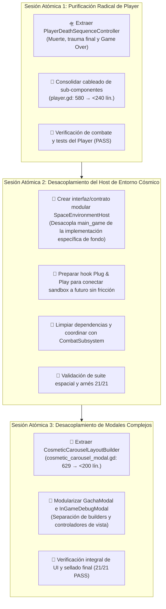

# Plan Maestro: Purificación Prístina de Arquitectura (Player, Preparación de Entorno y Modales)

> **Objetivo:** Llevar la arquitectura de Astra Dream a un estado **100% desacoplado y prístino**. Cada clase con una única responsabilidad clara, delegación estricta de componentes, eliminación de instanciación manual de UI en modales y **preparación de interfaces desacopladas en el entorno de combate** para que el nuevo sistema cósmico (que se mantendrá en `sandbox/` hasta su completa maduración visual) pueda conectarse en el futuro como un componente *Plug & Play* sin tocar la lógica de combate. Todo esto manteniendo la suite de pruebas al **100% PASS (21/21)**.

---

## 📊 Estado Actual vs Metas de Diseño

| Sistema / Archivo | Líneas Actuales | Deuda / Problema Arquitectónico | Meta Prístina |
| :--- | :---: | :--- | :---: |
| [`player.gd`](file:///c:/Users/Frani/.gemini/antigravity/scratch/astra_dream/scenes/combat/player/player.gd) | **580** | Fachada del jugador sobrecargada con cinemática de muerte, Game Over, feedback de trauma y cableado interno de wings/sprites. | **< 240** (Agregador puro) |
| **Entorno de Combate** (`scenes/combat/environment/`) | Disperso | `SpaceBackground` y `planet_spawner` acoplados. Falta una interfaz limpia (`SpaceEnvironmentHost`) que permita cambiar el backend de fondo (actual vs nuevo cósmico de sandbox) de forma transparente. | **Arquitectura Plug & Play desacoplada** |
| [`cosmetic_carousel_modal.gd`](file:///c:/Users/Frani/.gemini/antigravity/scratch/astra_dream/scenes/ui/cosmetics/cosmetic_carousel_modal.gd) | **629** | Orquestación mezclada con ~300 líneas de maquetación y estilos de tarjetas en código puro. | **< 200** |
| [`gacha_modal.gd`](file:///c:/Users/Frani/.gemini/antigravity/scratch/astra_dream/scenes/ui/gacha/gacha_modal.gd) | **507** | Lógica de gacha mezclada con control de cinemática de reveal y layout. | **< 220** |
| [`ingame_debug_modal.gd`](file:///c:/Users/Frani/.gemini/antigravity/scratch/astra_dream/scenes/ui/debug/ingame_debug_modal.gd) | **688** | Construcción masiva procedural de widgets de depuración dentro del script del modal. | **< 250** |

---

## 🗺️ Mapa de Ruta por Sesiones Atómicas

---

## 📝 Detalle de Tareas Técnicas por Sesión

### 📌 Sesión Atómica 1: Purificación de `Player` (Agregador Puro de Componentes)
* **Objetivo:** Transformar `player.gd` en un agregador ultraliviano y punto de entrada público que solo expone la API pública (`take_damage`, posición, getters de stats) y conecta señales.
* **Acciones:**
  1. Crear [`PlayerDeathSequenceController`](file:///c:/Users/Frani/.gemini/antigravity/scratch/astra_dream/scenes/combat/player/player_death_sequence_controller.gd) para albergar la cinemática de derrota, congelamiento de entrada, explosiones escalonadas y despacho a `EventBus` / `MainGame`.
  2. Mover el setup visual residual de wings y efectos pasivos a [`PlayerVisualBuilder`](file:///c:/Users/Frani/.gemini/antigravity/scratch/astra_dream/scenes/combat/player/player_visual_builder.gd).
  3. Reducir `player.gd` de **580 a <240 líneas**.
  4. Validar suites: `test_weapons_runner.tscn`, `test_phase2_tactical_focus_runner.tscn`, `test_proc_coefficients_and_osp_runner.tscn`.

---

### 📌 Sesión Atómica 2: Desacoplamiento del Host de Entorno Cósmico (Preparación Futura)
* **Objetivo:** Dejar el fondo de combate aislado tras una abstracción limpia (`CombatEnvironmentSubsystem` / `SpaceEnvironmentHost`). El juego continuará usando el fondo actual estable, pero el punto de montaje quedará 100% desacoplado y preparado para que cuando el sandbox esté listo, la sustitución sea instantánea cambiando un nodo o recurso, sin tocar `main_game.gd`.
* **Acciones:**
  1. Formalizar el contrato `BaseSpaceEnvironment` / `CombatEnvironmentSubsystem` como subsistema de combate estándar.
  2. Encapsular `space_background` y objetos orbitales dentro del subsistema de entorno, desacoplándolos de llamadas directas desde `main_game.gd`.
  3. Dejar los conectores de cámara, posición y parallax listos para recibir tanto el fondo actual como el nuevo de `sandbox/` en el momento que se decida su adopción.
  4. Validar arnés anti-regresiones (21/21 PASS).

---

### 📌 Sesión Atómica 3: Desacoplamiento de Modales Complejos (Poda de Layouts)
* **Objetivo:** Erradicar la instanciación de cientos de líneas de widgets de UI en scripts de modales mediante el patrón `LayoutBuilder`.
* **Acciones:**
  1. **Cosmetic Carousel:**
     - Crear `CosmeticCarouselLayoutBuilder` para desacoplar el armado procedural de tarjetas de skins y estilo visual.
     - Reducir `cosmetic_carousel_modal.gd` de **629 a <200 líneas**.
  2. **Gacha Modal:**
     - Extraer el teatro visual y los efectos de reveal hacia `GachaRevealTheater`.
     - Reducir `gacha_modal.gd` de **507 a <220 líneas**.
  3. **InGame Debug Modal:**
     - Separar la grilla de comandos y toggles en un builder reutilizable.
     - Reducir `ingame_debug_modal.gd` de **688 a <250 líneas**.
  4. Validar suites de UI: `test_skin_carousel_and_save_runner.tscn`, `test_slot_machine_and_gacha_runner.tscn`, `test_phase1_ui_polish_runner.tscn`.

---

## 🛡️ Criterios de Aceptación y Sellado
1. **Regla de Líneas Estricta:** Ningún orquestador, entidad o modal supera las 250 líneas (con excepción de `main_game.gd` < 350 lín.).
2. **Aislamiento de Sandbox:** El código experimental de `sandbox/` permanece intacto e independiente, sin filtrarse a producción antes de tiempo.
3. **Puntos de Montaje Plug & Play:** El entorno espacial queda encapsulado tras un subsistema desacoplado.
4. **Verificación Global:** Ejecución de `tools/run_tests.ps1 -CoreOnly` finalizando con **21 / 21 PASS (100% verde)**.
5. **Documentación Sincronizada:** Actualizar [`AGENT_CONTEXT.md`](file:///c:/Users/Frani/.gemini/antigravity/scratch/astra_dream/AGENT_CONTEXT.md) al cierre de cada sesión.
