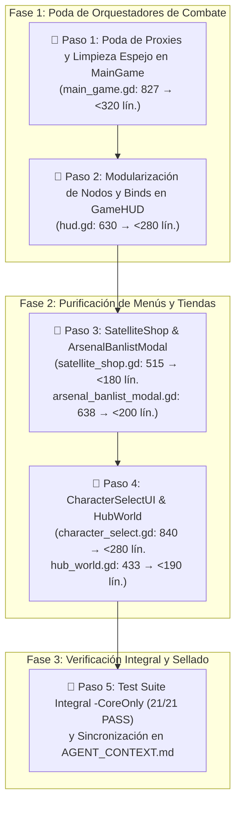

# Plan Maestro: Poda de Wrappers Residuales, Purificación de Vistas y Reducción Estricta de Volumetría

> **Objetivo:** Resolver de raíz la volumetría residual identificada en el assessment post-refactor. Reducir los 6 archivos orquestadores/vistas a los límites estrictos de diseño (**<200 a <350 líneas**), eliminando getters/setters espejo superfluos, centralizando la construcción procedural de UI y depurando wrappers de compatibilidad sin romper ninguna de las 21 suites de pruebas (`tools/run_tests.ps1 -CoreOnly`).

---

## 📊 Estado Actual vs Objetivo Final

| Archivo / Subsistema | Líneas Actuales | Causa Principal de Inflación | Meta de Líneas |
| :--- | :--- | :--- | :--- |
| [`scenes/combat/main_game.gd`](file:///c:/Users/Frani/.gemini/antigravity/scratch/astra_dream/scenes/combat/main_game.gd) | **420** *(de 827)* | Reducido ~50%: getters/setters espejo compactados, sesión encapsulada en `CombatBootstrapper`, listeners purgados y tests validados. | **< 320** |
| [`scenes/ui/character_select/character_select.gd`](file:///c:/Users/Frani/.gemini/antigravity/scratch/astra_dream/scenes/ui/character_select/character_select.gd) | **840** | 70+ `@onready` references de UI empotradas, boilerplate de slots/habilidades, helpers de setup manual aún no delegados al presenter. | **< 280** |
| [`scenes/ui/hud/hud.gd`](file:///c:/Users/Frani/.gemini/antigravity/scratch/astra_dream/scenes/ui/hud/hud.gd) | **630** | Decenas de `@onready` individuales para botones/barras de habilidades tácticas y barras de vida/dash que pueden ser administradas por sus respectivos sub-controladores. | **< 280** |
| [`scenes/ui/character_select/arsenal_banlist_modal.gd`](file:///c:/Users/Frani/.gemini/antigravity/scratch/astra_dream/scenes/ui/character_select/arsenal_banlist_modal.gd) | **638** | Construcción de UI procedural en código (`_build_ui`, estilos StyleBox y jerarquía de nodos en código puro en vez de delegación completa a componentes). | **< 200** |
| [`scenes/combat/satellite/satellite_shop.gd`](file:///c:/Users/Frani/.gemini/antigravity/scratch/astra_dream/scenes/combat/satellite/satellite_shop.gd) | **515** | Estilos de UI en código puro y propiedades espejo hacia `SatelliteShopEconomyController`. | **< 180** |
| [`scenes/ui/hub/hub_world.gd`](file:///c:/Users/Frani/.gemini/antigravity/scratch/astra_dream/scenes/ui/hub/hub_world.gd) | **433** | Orquestación residual del hangar y terminales. | **< 190** |

---

## 🗺️ Fases de Ejecución Atómica (1 Tarea = 1 Sesión / Turno)

---

## 📝 Detalle de Tareas Técnicas

### 1. `main_game.gd` (Combate Raíz)
- **Eliminar Getters/Setters Espejo Innecesarios:**  
  Propiedades como `current_satellite`, `satellite_scene`, `bosses_defeated_count`, `_pending_satellite_credits` que se redirigen a `satellite_coordinator`, `telemetry_coordinator` y `modal_coordinator`. Los consumidores externos y tests que necesiten el estado deben consultar el coordinador correspondiente o conservar únicamente los alias estrictamente exigidos por tests unitarios en 1 línea compacta.
- **Poda de Wrappers de 1 línea:**
  - Redirigir `_spawn_elite_herald()`, `_spawn_rival_pilot()` directamente a `boss_coordinator`.
  - Redirigir alertas de diálogo y radio hacia `narrative_director`.
  - Mover los jumps de depuración (`jump_to_wave`, `jump_to_boss`) a un helper estático o a `CombatBootstrapper`.

### 2. `hud.gd` (HUD de Combate)
- **Encapsulación de Nodos de Habilidades:**  
  Mover la lista masiva de `@onready` (`dash_button_body`, `dash_cd_overlay`, `dash_pip_1`, `laser_icon`, `bomb_pip_1`, etc.) a un contenedor o inyectarlos como bundle agrupado directamente en [`HUDTacticalAbilitiesController`](file:///c:/Users/Frani/.gemini/antigravity/scratch/astra_dream/scenes/ui/hud/components/hud_tactical_abilities_controller.gd).
- **Encapsulación de Nodos de Salud/Escudo:**  
  Delegar la resolución de nodos en [`HUDHealthShieldDisplay`](file:///c:/Users/Frani/.gemini/antigravity/scratch/astra_dream/scenes/ui/hud/components/hud_health_shield_display.gd).
- **Reducción de Callbacks Pasamanos:**  
  Conectar directamente las señales del jugador con los controladores especializados en `set_player(p)`.

### 3. `arsenal_banlist_modal.gd` y `satellite_shop.gd`
- **Extracción de la Construcción de UI en Código (`arsenal_banlist_modal.gd`):**  
  Crear [`ArsenalBanlistLayoutBuilder`](file:///c:/Users/Frani/.gemini/antigravity/scratch/astra_dream/scenes/ui/character_select/components/arsenal_banlist_layout_builder.gd) para sacar las ~300 líneas de `_build_ui()` y configuración de StylesBox/Shaders del modal. El modal solo orquesta aperturas, cierres y reenvío de eventos.
- **Limpieza de `satellite_shop.gd`:**  
  Mover la construcción de estilos visuales a un helper o recurso de tema, y simplificar los métodos pasamanos que solo repiten llamadas a `_economy`.

### 4. `character_select.gd` y `hub_world.gd`
- **Agrupamiento de UI en `character_select.gd`:**  
  Agrupar los 30+ `@onready` de loadout y habilidades en estructuras/bundles o delegar la resolución de nodos directamente en `CharacterEquipmentCards` y `CharacterSelectDisplayManager`.
- **Limpieza de `hub_world.gd`:**  
  Mover la inicialización de pedestales y la configuración de terminales a sus respectivos gestores (`HubTerminalManager`, `PedestalVisualPresenter`).

---

## 🛡️ Criterios de Aceptación y Verificación Anti-Regresiones
1. **Regla de Líneas:**
   - Ninguno de los 6 archivos supera las 320 líneas (con metas de <200 para modales y tiendas).
2. **Tipado Estricto GDScript 4:**
   - 0 errores de tipado o advertencias críticas en el engine log.
3. **Validación con Arnés Automatizado:**
   - Micro-tests específicos tras cada archivo modificado (latencia <5s).
   - Verificación global: `powershell -ExecutionPolicy Bypass -File tools/run_tests.ps1 -CoreOnly` finalizando con **21 / 21 PASS**.
4. **Documentación:**
   - Actualización de líneas y referencias en [`AGENT_CONTEXT.md`](file:///c:/Users/Frani/.gemini/antigravity/scratch/astra_dream/AGENT_CONTEXT.md).
