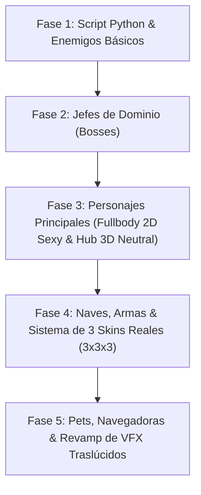

# Plan Maestro de Revamp Visual y Generación de Assets — Astra Dream

> **Objetivo:** Reemplazar progresivamente todos los placeholders gráficos del juego con imágenes 2D/3D generadas por IA sobre fondo Chroma Key Magenta (`#FF00FF`), procesadas automáticamente mediante un script de Python con recorte Bounding Box y canal alfa, e integrar un sistema completo de Skins Reales 3x3x3 para el elenco principal, Pets y Navegadoras.

---

## 🛠️ Herramienta Base: Script de Remoción de Fondo Chroma Key (`scripts/tools/chroma_remover.py`)

- **Color de clave:** Magenta `#FF00FF` (RGB 255, 0, 255).
- **Lógica del script (Python + OpenCV / Pillow):**
  - Detección del rango de color Magenta con tolerancia de antialiasing.
  - Conversión del fondo a canal Alpha transparente (`RGBA`).
  - Recorte automático ajustado al área delimitadora visible (**Bounding Box Auto-Crop**).
  - Normalización de salida en formato `.png` a resolución objetivo y generación de archivos `.import` de Godot en caso necesario.

---

## 📋 Fases del Plan de Ejecución

---

### 👾 Fase 1: Enemigos Básicos (Minions y Elites)
* **Formato:** Sprites 2D de alta resolución (512x512px) con fondo `#FF00FF` procesado.
* **Estilo:** Ilustrado 2D anime/sci-fi con detalles bioluminiscentes.
* **Lista de Sprites a reemplazar:**
  1. `enemy_drone` (Dron táctico ligero)
  2. `enemy_shooter` (Cazador de proyectiles)
  3. `enemy_tank` (Blindado de asalto)
  4. `enemy_kamikaze` (Cápsula explosiva de pulso)
  5. `enemy_splitter` (Enemigo fragmentable)
  6. `enemy_micro_flock` (Enjambre nano-bot)
  7. `damage_accumulator` & `resonance_containment_node` (Nodos de evento)

---

### ☠️ Fase 2: Jefes de Dominio (Bosses)
* **Formato:** Sprites 2D colosales (512x512px a 1024x1024px) procesados con canal alfa.
* **Estilo:** Mecha imponente, bio-orgánico u oscuro arcano según el dominio.
* **Lista de Sprites a reemplazar:**
  1. `boss_ash_clock` (Reloj del Juicio Arcano)
  2. `boss_mothership` (Nave Nodriza de Enjambres)
  3. `boss_broken_mirror` (Espejo Estelar Quebrado)
  4. `boss_hermit_void` (H ermitaño del Vacío)
  5. `boss_overflow_vortex` (Vórtice de Sobrecarga)
  6. `boss_astra_prime` (Entidad Astra Prime)
  7. `nyx_boss_escort` & `rival_pilot_boss` (Naves de Combate de Rivales)

---

### 💃 Fase 3: Personajes Principales (Fullbody 2D & Hub Cutout)
* **Variantes por Personaje del Elenco Principal:**
  1. **Fullbody Combate / Menús (Sexy & Provocativo):** Poses dinámicas allure/sexy con expresiones de victoria/combate, vestuarios detallados de alta fidelidad.
  2. **Fullbody Hub 3D (Elegante & Neutral):** Poses erguidas, neutras y limpias ideales para el cutout 2D sobre escenarios 3D sin desentonar.
* **Integración:** Actualización de diálogos, HUD de combate, pantallas de selección y nodos Cutout 3D del Hub.

---

### 🛸 Fase 4: Pilotas en Traje de Combate (Reemplazo de Naves), Armas y Sistema de 3 Skins Reales (3x3x3)
* **Nuevo Concepto de Combate:**
  * Se reemplazan los modelos de naves espaciales tradicionales en combate por las **Pilotas volando directamente en Trajes de Combate Tácticos / Exotrajes** (*Top-Down / 3/4 Isometric perspective*).
* **Reemplazo de Placeholders de Recolor:**
  * Eliminación completa del tinte Shader simple (`modulate` / recolor plano).
  * Creación de 3 versiones verdaderamente únicas de diseño para:
    * **3 Skins de Personaje Fullbody** (Hub 3D y Diálogos)
    * **3 Skins de Traje de Combate Voador / Exotraje** (En lugar de la nave espacial 2D)
    * **3 Skins de Arma** por Piloto
* **Temáticas Coordinadas:**
  1. *Skin Base / Tactical Exo-Suit*
  2. *Cyberpunk Night / Neon Void Armor*
  3. *Verano / Swimsuit Propulsion Pack* (o Gothic Mecha Wings)

---

### 🐾 Fase 5: Pets, Navegadoras y Revamp de VFX Traslúcidos
* **Mascotas (Pets) & Navegadoras (Navigators):**
  * Sprites finales generados para `cosmo`, `kuro`, `luna`, `mochi`, `pip`.
  * Portratos HD para `caelia`, `iris`, `lyra`, `vespera`, `zephyr`.
* **Revamp Completo de VFX de Skins:**
  * Reemplazo de los efectos que tapan/bloquean la ilustración del personaje.
  * Implementación de **Shader de Rim Lighting**, auras de neón traslúcidas y sistemas de partículas orbitales alrededor del personaje sin oscurecer su arte.

---

## 📌 Próximos Pasos Recomendados

1. **Aprobar el Plan:** Haz clic en **Proceed** para dar comienzo a la **Fase 1**.
2. **Creación del Script Python:** Se construirá `scripts/tools/chroma_remover.py` para automatizar la limpieza de imágenes generadas.
3. **Generación por Lotes de Enemigos:** Se irán generando e integrando los sprites de los enemigos básicos.
